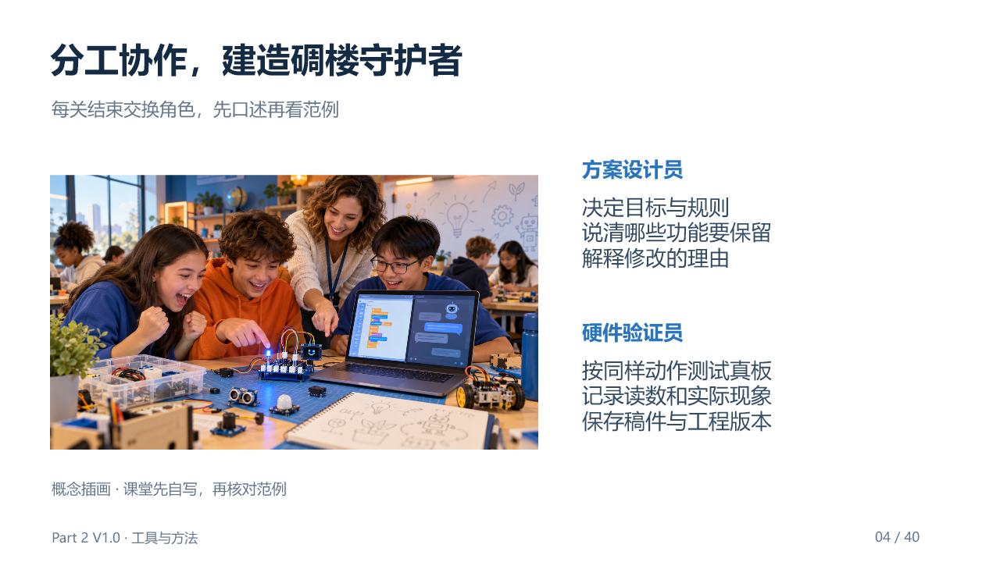

# Part 2｜建造AI碉楼守护者 · V1.0统一教学版

本部分公开 **40页图文课件、285分钟净教学安排**，以及教师讲义、学员任务册、课堂记录单、十关任务卡、Prompt能力地图、Gate0课前验收和必要配图。两人一组，围绕“分工协作，建造碉楼守护者”学习AI硬件编程。

课程V1.0与网页工具Mission Center V0.4分别标注。公开材料已做文件、版面和引用核对；真实课堂LLM、CodeCraft库、编译烧录和硬件效果仍按Gate0确认。开发文档、制作脚本、源数据、历史版本和备份不上传，本地内容保留。

## 备课与授课入口

| 使用者 | 材料 |
|---|---|
| 首次带课的教师 | [教师讲义](教师讲义.md)、[285分钟安排](课程总览与285分钟安排.md)、[Gate0课前验收](Gate0_CodeCraft真机验证矩阵.md) |
| 课堂投影 | [40页教学PPT](教学课件.pptx)、[逐页预览](教学素材/课件预览/index.html) |
| 学员与小组 | [学员任务册](学员任务册.md)、[课堂记录单](课堂记录单.md)、[十关任务卡](任务卡/) |
| 查询与讲解 | [教学资料索引](教学资料索引.md)、[Prompt能力地图](Prompt能力地图.md)、[硬件图说明](教学素材/硬件图/使用说明.md) |

配套 **Mission Center网页** 通过碉楼故事和三章十关，引导学员表达需求、用CodeCraft AI编程、在真板上验证，再根据实际结果修改。

[下载单文件网页](../../web/part2/Part2_AI_Guardian_MissionCenter_V0.4.html) · [完整使用说明](../../web/part2/README.md) · [接口与引脚参考](教学素材/硬件图/传感器接口与引脚说明.md)

## 快速开始

1. 下载仓库，在桌面 Chrome / Edge 中打开 `web/part2/Part2_AI_Guardian_MissionCenter_V0.4.html`。图片与脚本均已内嵌，无需安装依赖。
2. 在“学习设置”确认板卡版本，从 M01 开始。每关七个步骤都可直接点击切换。
3. 写出自己的 Prompt，核对硬件、规则和验证方式。需要 AI 评分与润色时，再在顶部“LLM API 设置”填写兼容接口、模型和 Key。
4. 将提示词交给 CodeCraft AI 生成程序、编译、烧录，记录真实结果和 V2 复测。

GitHub 文件页只展示或下载源码，不能直接运行 HTML。Mission Center 不连接开发板；进入 Part2 前先关闭 Part1 的串口连接，由 CodeCraft 使用设备。

## 任务引导

七步为：**任务 → 线索 → Prompt → CodeCraft → 真机 → 反馈 → 通关**。页面明确本关要做什么、怎样操作、应观察什么结果和本步需要留下什么记录。

学习主题是 **“分工协作，建造碉楼守护者”**。方案设计员制定目标、规则与修改要求，硬件验证员操作CodeCraft和真板、记录现象并复测；每关结束交换角色。

| 章节 | 关卡 | 学习重点 |
|---|---|---|
| 守护者觉醒 | M01 OLED、M02 LED、M03 蜂鸣器 | 输出内容、行为、时间与节奏 |
| 守护者感知 | M04 光线、M05 光线与声音、M06 状态与按键、M07 旋钮 | 实测阈值、逻辑条件、状态保持与参数调节 |
| 守护者进阶 | M08 温湿度与气压、M09 加速度、M10 综合系统 | 板卡版本、姿态规则、独立描述系统需求 |

基础任务明确分工：M05只用光线、声音与LED完成四种组合；M06先恢复环境再按键确认，并检查再次触发；M07单独练习旋钮改变声音阈值，不沿用锁存警报。M08在V1之前确认模块、库与单位；M09先记录XYZ基线，三轴加速度不能单独测Yaw。M10自主选择至少三个协作的功能模块，主控与USB不计数，并完成一次有目的的V2复测。

第4步生成、编译和烧录V1，第5步记录V1真机现象，第6步再改进并复测。前九关V1已符合且无需改变时可注明保留V1并重复验证，不制造失败记录。

## 先评价，再按需润色

学员先写自己的要求，查看六项评分与建议，先尝试自行补充，再决定是否请求 AI 润色。建议稿与原稿对照显示，需要手动采用；修改后重新评分。M10 以学员自写的完整需求为起点。

截图使用未配置 API 的真实界面，仅展示编辑和按钮入口。API Key 只保留在当前页面会话，刷新后需重填；请求在点击评分或润色时发送。评分评价表达质量，不证明代码或真板运行成功。

## 实时硬件图

勾选模块后，JavaScript + SVG 会实时绘出全部已选元件及已确认接口的线路；增删即时更新，点击只高亮。主板保持固定比例并居中，元件自动利用上下左右空间。默认“适应画布”完整显示，“原尺寸”和“放大查看”用于检查触点，也可下载当前 SVG。

同时提供官方实物照片识别和接口表：数字 IO、模拟 ADC、I²C、旧 DHT11 的 D3 单线时序，以及新 DHT20 的 I²C 会明确区分。版本未知时先确认，图不猜固定接口。

上图由教师模式选择十个模块后从网页实际生成的SVG导出，是模块池示例，不是M10预选系统。完整Grove套件通过PCB连接，课堂只需USB；图示不检测或控制硬件。

## 保存与当前验证范围

进度、草稿和记录保存在当前浏览器，可导出建造日志。更换电脑、浏览器或文件地址时不保证自动沿用；CodeCraft 工程仍应独立保存。教师模式用于查看各关，展示后主动退出。

网页通关按钮与勾选不检查硬件结果，教师另看真实证据。评分上下文不会自动核对全部图示选择、接口与实测数据，应把关键信息写入Prompt；修改后主动核对并重新评分。导出日志不保证保留实际送入CodeCraft的V1稿，V1/V2文本、完整工程和真实记录需另外保存。V2实验按第6步完成后回填网页既有复测栏，栏位位置不改变实验顺序。

网页交互、1024 种模块组合布局、桌面/手机完整显示、SVG 导出及模拟 API 流程已检查。真实模型调用、CodeCraft 编译烧录和课堂硬件效果仍需教师在实际环境验证。

本次按Part1规则公开当前教学材料、预览、配图及网页工具。GitHub文件页不直接运行HTML预览，可下载后在本地浏览器打开；课件PNG可直接查看。课程制作数据、开发记录和旧版本保留本地，Part3尚未发布。

## 来源与许可

本课程改编与来源见 [ATTRIBUTION.md](../../ATTRIBUTION.md)。项目原创 Web 代码按 MIT、课程内容按 CC BY 4.0；第三方图片及商标保留原权利，详见 [LICENSE.md](../../LICENSE.md) 与 [THIRD_PARTY_NOTICES.md](../../THIRD_PARTY_NOTICES.md)。
