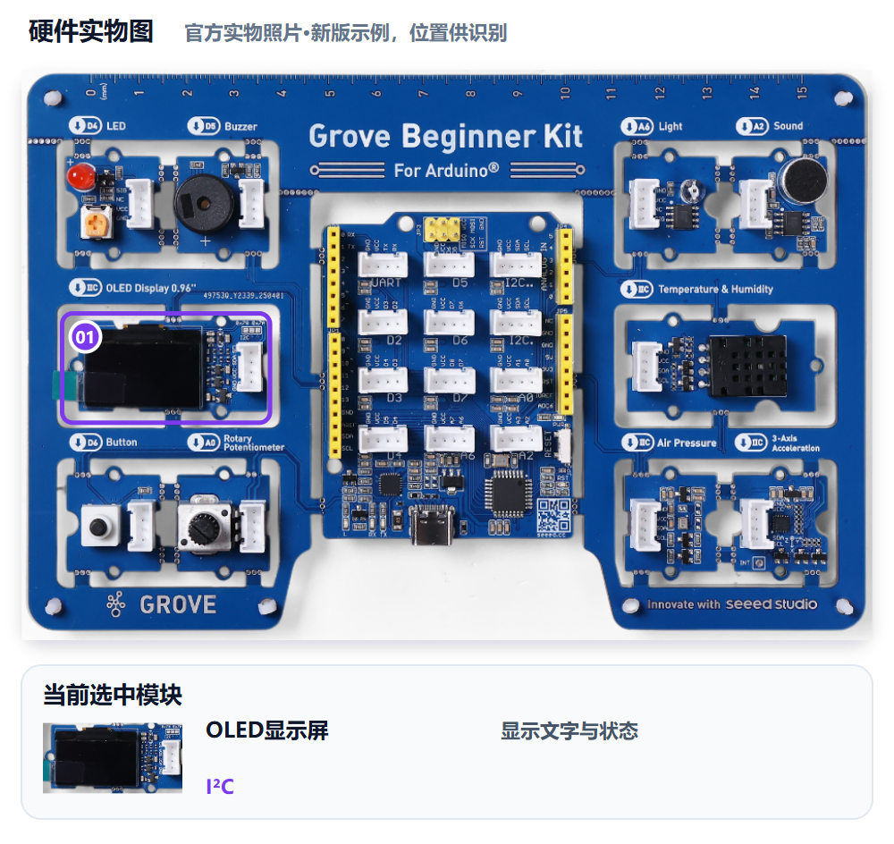
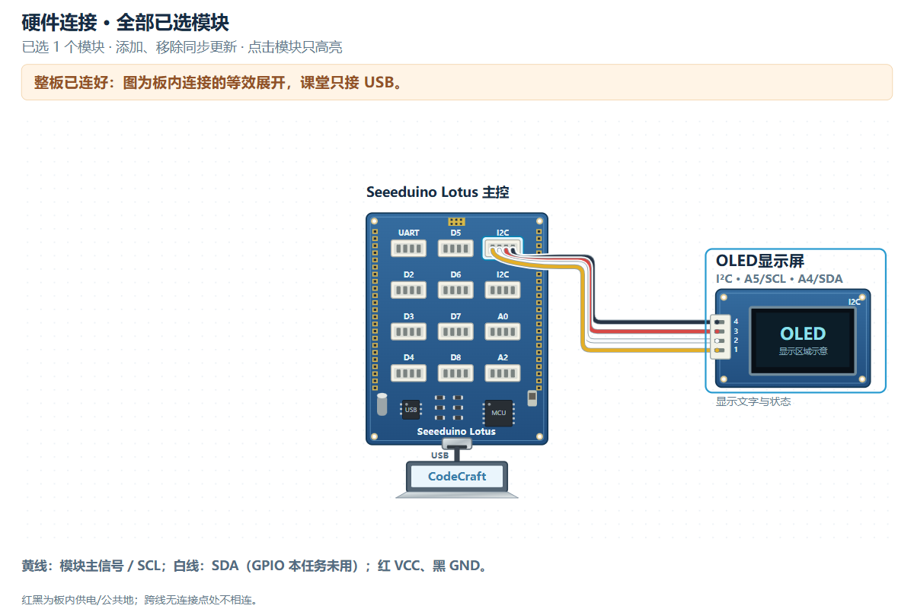

# M01｜唤醒守护者 · V1.0统一教学版

章节：第一章 守护者觉醒　建议时间：25分钟（未试教计时）

基础功能模块：**OLED**　[主课件](../教学课件.pptx)：**第15—16页**

[本关网页](../../../web/part2/Part2_AI_Guardian_MissionCenter_V0.4.html)仍为Mission Center V0.4；七步可点击回看，步骤/勾选/徽章不代替真实验收。

## 本关硬件对照





完整整板已由PCB预连接，实际只接USB，不拆板或照图外接线。实物图用于认位置，接线图是板内等效展开，不是运行证据。网页默认适应画布完整显示，原尺寸可滚动；点击只高亮、不检测实物，也不改程序。

OLED使用I2C，共用A4 SDA、A5 SCL。显示库和地址按本班Gate0记录确认；本关只做OLED，不保留其他模块行为。

可看[实物图SVG](../教学素材/硬件图/M01_硬件实物图.svg)、[接线SVG](../教学素材/硬件图/M01_板内接线示意.svg)及[接口说明](../教学素材/硬件图/传感器接口与引脚说明.md)。支持程度以实际教室Gate0为准。

## 1. 任务导入

值守台刚亮起，守护者需要说明自己的身份与启动状态。两行能读懂的文字比一句“屏幕亮了”更有用：别人能看懂，你们也能在重启后重复检查。

**本关任务：**让OLED稳定显示两行：第一行身份/组名，第二行启动状态；重新启动后仍显示。

**最低产出：**两行启动牌和重启记录，以及实际Prompt、完整工程和对应真实记录。

1. 方案设计员用自己的话说本组目标。
2. 硬件验证员复述将看到什么，先约定测试动作。
3. 两人核对本关基础模块和边界；前九关不强制累计所有旧功能。

本组目标与成功标准：________________________________________________

## 2. 准备线索

先决定两行具体文字与成功标准，再请AI生成。

1. 第一行写身份或短组名，第二行写状态。
2. 优先使用ASCII短英文/数字；中文支持须经Gate0确认。
3. 确认本关只有OLED，要求AI不添加灯、声音或传感器行为。
4. 把“烧录后核对两行，再断电重连核对”写成验收动作。

| 本组线索 | 为什么要写 | 本组填写 |
|---|---|---|
| 第一行原文 | 精确到可以直接对照屏幕 |  |
| 第二行原文 | 让别人知道系统状态 |  |
| 库/接口确认来源 | 使用本班已验证信息 |  |

尚未确认的信息与确认来源：__________________________________________

## 3. 写出自己的提示词

模糊表达：

> 帮我让屏幕显示一下。

表达支架示例，请替换成自己的目的与已确认信息：

```text
我使用Grove Beginner Kit的板载OLED，接口为I2C。请用已确认的显示库显示两行：第一行【本组身份】，第二行【本组状态】。只做显示，不加入其他模块。烧录后核对两行内容，并断电重连验证仍显示。
```

检查问题：

- 两行原文是否具体，长度适合显示？
- 是否写清已确认的硬件/接口与只做显示的边界？
- 是否有重启后仍显示的验收动作？

先在编辑框写自己的稿，点击评分后读一条理由、自己补一处；仍需帮助才润色。对比原稿/建议，核对真实值、接口与规则，人工采用后重新评分。六项100分：目标15、硬件15、规则与参数25、输出15、边界10、验证20；表达分数不证明程序或真板成功。

教师配置接口后教练才可用；Key只在当前页面会话、刷新重填，不写入文本。不可用时用本卡检查问题和同伴核对继续CodeCraft。图示/实测字段不保证自动进入评分上下文，关键确认信息写进Prompt，改变版本、模块、数据或规则后重新核对。

本组原稿/实际稿件位置：______________________________________________

评分理由与我先自行补充：____________________________________________

AI建议/采用或保留理由与重评：________________________________________

## 4. CodeCraft生成、编译与烧录V1

OLED库或地址不确定时按Gate0先确认，不让AI猜成另一种外接屏幕。

1. 确认Part1 Twin或其他读数窗口已释放串口，用USB数据线连接完整板。
2. 使用老师Gate0确认的CodeCraft入口、板卡、连接与库。
3. **另存实际送入CodeCraft的V1 Prompt原文**，标明M01/V1；网页导出不保证是实际V1准确快照。
4. 让CodeCraft生成程序，核对基础模块和关键逻辑；先编译，读取完整结果。
5. 编译通过后烧录，确认写入结果；失败先记录完整错误，不声称真板已运行。
6. 保存V1完整工程/版本，保留后再进入测试或修改。

实际V1 Prompt保存位置：_____________________________________________

V1完整工程/版本位置：________________________________________________

生成：□成功 □失败 □未尝试　编译：□成功 □失败 □未尝试

烧录：□成功 □失败 □未尝试　完整错误/实际操作：______________________

## 5. 仅做V1真机验证

方案设计员先说预期，硬件验证员操作，一起填写真实观察。**本步不修改参数、不提前做V2，不覆盖第一版。**尚未烧录成功时记录阶段和错误，不填写虚构运行结果。

| 实际动作 | 预期 | V1真实观察 |
|---|---|---|
| 烧录后看OLED正面 | 出现本组要求的两行原文 |  |
| 断电重连，等启动后观察 | 同样两行自动再次显示 |  |
| 观察其他输出 | 无额外灯光、声音或复杂交互 |  |


V1原始读数、单位或实际现象：__________________________________________

V1照片/完整错误/真实记录位置：_______________________________________

## 6. 反馈与同动作复测

围绕显示内容、排版或多余功能定位差异；正确的库、接口和第一行可以保留。

先选择：□根据问题/目标做V2　□V1已符合且无必要改动，保留V1并重复验证。

保留或修改依据：________________　正确部分要保留：________________

修改/改进示例：若第二行不够明确，V2只把状态文字改成更清楚的表达；如果已经合适，可保留V1并重复重启测试。

本组这次只修改：____________________________________________________

实际V2 Prompt与完整工程另存位置（保留V1时注明）：____________________

执行方式：将具体反馈交给CodeCraft，只改声明的一项；重新编译、烧录并记录结果，再用第5步的同一动作复测。保留V1时不虚构新版本，重复原动作记录。

完成V2实验后回到网页既有复测栏回填，并明确标记轮次；栏位位置不改变实验顺序。网页第6步返回仍会回到第5步，不代表必须重新做一遍V1。

V2生成/编译/烧录结果及完整错误（如适用）：____________________________

| 与第5步相同的动作 | 复测结果（V2或保留V1） |
|---|---|
| 烧录后看OLED正面 |  |
| 断电重连，等启动后观察 |  |
| 观察其他输出 |  |

相对V1的变化/保留结论：______________________________________________

## 7. 保存成果与讲解

- 哪句要求让AI知道准确显示什么？
- 怎样证明结果能够重启后重复出现？
- 你们保留了哪部分，为什么不加下一关功能？

我的发现与判断依据：________________________________________________

□实际使用的V1/V2 Prompt原文已另存（或明确保留V1）

□完整CodeCraft工程与版本已保存　□重新打开核对

□真实读数、现象、错误及复测已保存　□网页日志已导出

保存位置：________________　教师核对：________________　下一关交换角色：□

网页日志不能替代实际稿或完整工程。保留Day1独立成果，Part3可能覆盖板上程序；末20分钟含展示12、总结3、保存并重开5，285为净教学、休息另计。

下一关练习LED行为参数；知识继续使用，程序不强制保留OLED。
