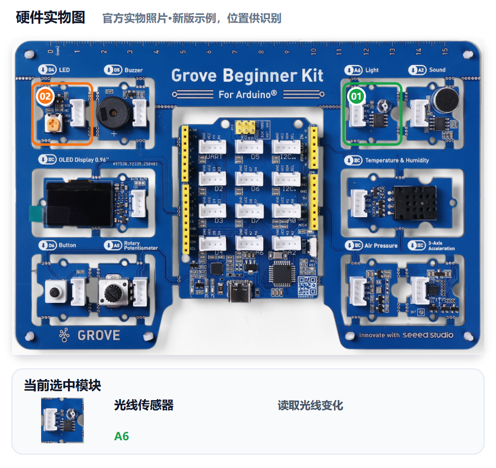
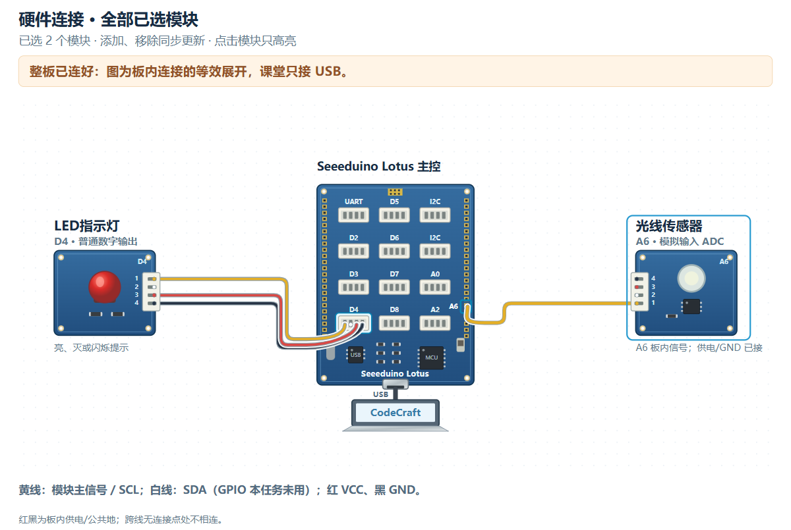

# M04｜给守护者装上眼睛 · V1.0统一教学版

章节：第二章 守护者感知　建议时间：30分钟（未试教计时）

基础功能模块：**光线＋LED**　[主课件](../教学课件.pptx)：**第21—23页**

[本关网页](../../../web/part2/Part2_AI_Guardian_MissionCenter_V0.4.html)仍为Mission Center V0.4；七步可点击回看，步骤/勾选/徽章不代替真实验收。

## 本关硬件对照





完整整板已由PCB预连接，实际只接USB，不拆板或照图外接线。实物图用于认位置，接线图是板内等效展开，不是运行证据。网页默认适应画布完整显示，原尺寸可滚动；点击只高亮、不检测实物，也不改程序。

光线为A6模拟ADC输入，LED为D4数字输出，无硬件PWM。本关只用这两个功能模块；先做临时Probe，不默认保留屏幕或声音。

可看[实物图SVG](../教学素材/硬件图/M04_硬件实物图.svg)、[接线SVG](../教学素材/硬件图/M04_板内接线示意.svg)及[接口说明](../教学素材/硬件图/传感器接口与引脚说明.md)。支持程度以实际教室Gate0为准。

## 1. 任务导入

教室光线每天不同，AI不知道你们桌面真实情况。你们要先测亮处和遮挡的数据，再说明哪个比较方向与阈值能表示“暗”，而不是直接抄一个数字。

**本关任务：**先采样亮暗范围，确认方向与阈值依据，再让暗光点亮LED、亮环境关闭LED，并能恢复。

**最低产出：**亮暗采样、阈值依据和明暗恢复记录，以及实际Prompt、完整工程和对应真实记录。

1. 方案设计员用自己的话说本组目标。
2. 硬件验证员复述将看到什么，先约定测试动作。
3. 两人核对本关基础模块和边界；前九关不强制累计所有旧功能。

本组目标与成功标准：________________________________________________

## 2. 准备线索

先测量，再判断，再实现。

### 光线Probe：只读取，不控制

```text
请读取Grove Beginner Kit板载光线A6的原始读数，按老师已确认的方法显示/输出用于记录。不要控制LED，不写暗光判断，不加入其他模块。请说明读取方式和返回范围需要怎样核对。
```

1. 在CodeCraft生成、编译、烧录临时Probe，按Gate0方法读取。
2. 较亮、遮挡各记录至少三次和范围，再看遮挡使数值变大还是变小。
3. 两组范围重叠时先调整情境或补测，不强塞一个阈值。
4. 阈值选在能区分两组的区域，并写清比较方向；串口读数窗口占用时，上传控制V1前按已验证方法释放。

| 情境 | 第1次 | 第2次 | 第3次 | 范围 |
|---|---|---|---|---|
| 较亮 |  |  |  |  |
| 遮挡 |  |  |  |  |

读取方式/范围：________________　暗光方向：________________

阈值与理由：________________　重叠时的补测：________________

Probe稿/工程另存位置：________________；Probe不是最终控制V1通过。

尚未确认的信息与确认来源：__________________________________________

## 3. 写出自己的提示词

模糊表达：

> 天黑就亮灯。

表达支架示例，请替换成自己的目的与已确认信息：

```text
我使用Grove Beginner Kit光线A6和LED D4。本组亮处范围为【实测】，遮挡范围为【实测】；遮挡后数值【增大/减小】，选择阈值【本组数值】，依据是【理由】。当光线【高于/低于，按实测选择】阈值代表暗时，点亮LED，否则关闭。只用光线和LED，请给明亮、遮挡、移开及阈值附近的验证动作。
```

检查问题：

- 范围和方向是否来自本组测量？
- 重叠读数是否已补测，阈值是否有依据？
- 是否明确暗光条件与LED的亮/灭及恢复？

先在编辑框写自己的稿，点击评分后读一条理由、自己补一处；仍需帮助才润色。对比原稿/建议，核对真实值、接口与规则，人工采用后重新评分。六项100分：目标15、硬件15、规则与参数25、输出15、边界10、验证20；表达分数不证明程序或真板成功。

教师配置接口后教练才可用；Key只在当前页面会话、刷新重填，不写入文本。不可用时用本卡检查问题和同伴核对继续CodeCraft。图示/实测字段不保证自动进入评分上下文，关键确认信息写进Prompt，改变版本、模块、数据或规则后重新核对。

本组原稿/实际稿件位置：______________________________________________

评分理由与我先自行补充：____________________________________________

AI建议/采用或保留理由与重评：________________________________________

## 4. CodeCraft生成、编译与烧录V1

正式控制V1与临时Probe分开保存；AI必须按本组方向比较，不默认“低于”才暗。

1. 确认Part1 Twin或其他读数窗口已释放串口，用USB数据线连接完整板。
2. 使用老师Gate0确认的CodeCraft入口、板卡、连接与库。
3. **另存实际送入CodeCraft的V1 Prompt原文**，标明M04/V1；网页导出不保证是实际V1准确快照。
4. 让CodeCraft生成程序，核对基础模块和关键逻辑；先编译，读取完整结果。
5. 编译通过后烧录，确认写入结果；失败先记录完整错误，不声称真板已运行。
6. 保存V1完整工程/版本，保留后再进入测试或修改。

实际V1 Prompt保存位置：_____________________________________________

V1完整工程/版本位置：________________________________________________

生成：□成功 □失败 □未尝试　编译：□成功 □失败 □未尝试

烧录：□成功 □失败 □未尝试　完整错误/实际操作：______________________

## 5. 仅做V1真机验证

方案设计员先说预期，硬件验证员操作，一起填写真实观察。**本步不修改参数、不提前做V2，不覆盖第一版。**尚未烧录成功时记录阶段和错误，不填写虚构运行结果。

| 实际动作 | 预期 | V1真实观察 |
|---|---|---|
| 较亮环境观察 | LED为本组定义的正常状态 |  |
| 遮挡传感器 | 读数进入暗光条件，LED按规则改变 |  |
| 移开遮挡 | LED恢复正常状态 |  |
| 缓慢改变遮挡至阈值附近并记录 | 能按已经声明的比较关系解释结果 |  |


V1原始读数、单位或实际现象：__________________________________________

V1照片/完整错误/真实记录位置：_______________________________________

## 6. 反馈与同动作复测

依据实测只改阈值或比较方向中的一项，正确的接口与输出不动，不同时加声音。

先选择：□根据问题/目标做V2　□V1已符合且无必要改动，保留V1并重复验证。

保留或修改依据：________________　正确部分要保留：________________

修改/改进示例：V2只调整有依据的阈值，或只纠正比较方向；重复明亮、遮挡、移开和同样边界动作。

本组这次只修改：____________________________________________________

实际V2 Prompt与完整工程另存位置（保留V1时注明）：____________________

执行方式：将具体反馈交给CodeCraft，只改声明的一项；重新编译、烧录并记录结果，再用第5步的同一动作复测。保留V1时不虚构新版本，重复原动作记录。

完成V2实验后回到网页既有复测栏回填，并明确标记轮次；栏位位置不改变实验顺序。网页第6步返回仍会回到第5步，不代表必须重新做一遍V1。

V2生成/编译/烧录结果及完整错误（如适用）：____________________________

| 与第5步相同的动作 | 复测结果（V2或保留V1） |
|---|---|
| 较亮环境观察 |  |
| 遮挡传感器 |  |
| 移开遮挡 |  |
| 缓慢改变遮挡至阈值附近并记录 |  |

相对V1的变化/保留结论：______________________________________________

## 7. 保存成果与讲解

- 为什么阈值不能直接抄示例？
- 读数范围重叠时为什么先测而不是先改程序？
- 你们怎样证明暗光比较方向正确？

我的发现与判断依据：________________________________________________

□实际使用的V1/V2 Prompt原文已另存（或明确保留V1）

□完整CodeCraft工程与版本已保存　□重新打开核对

□真实读数、现象、错误及复测已保存　□网页日志已导出

保存位置：________________　教师核对：________________　下一关交换角色：□

网页日志不能替代实际稿或完整工程。保留Day1独立成果，Part3可能覆盖板上程序；末20分钟含展示12、总结3、保存并重开5，285为净教学、休息另计。

M05加入声音，学习两个条件同时成立的AND规则。
