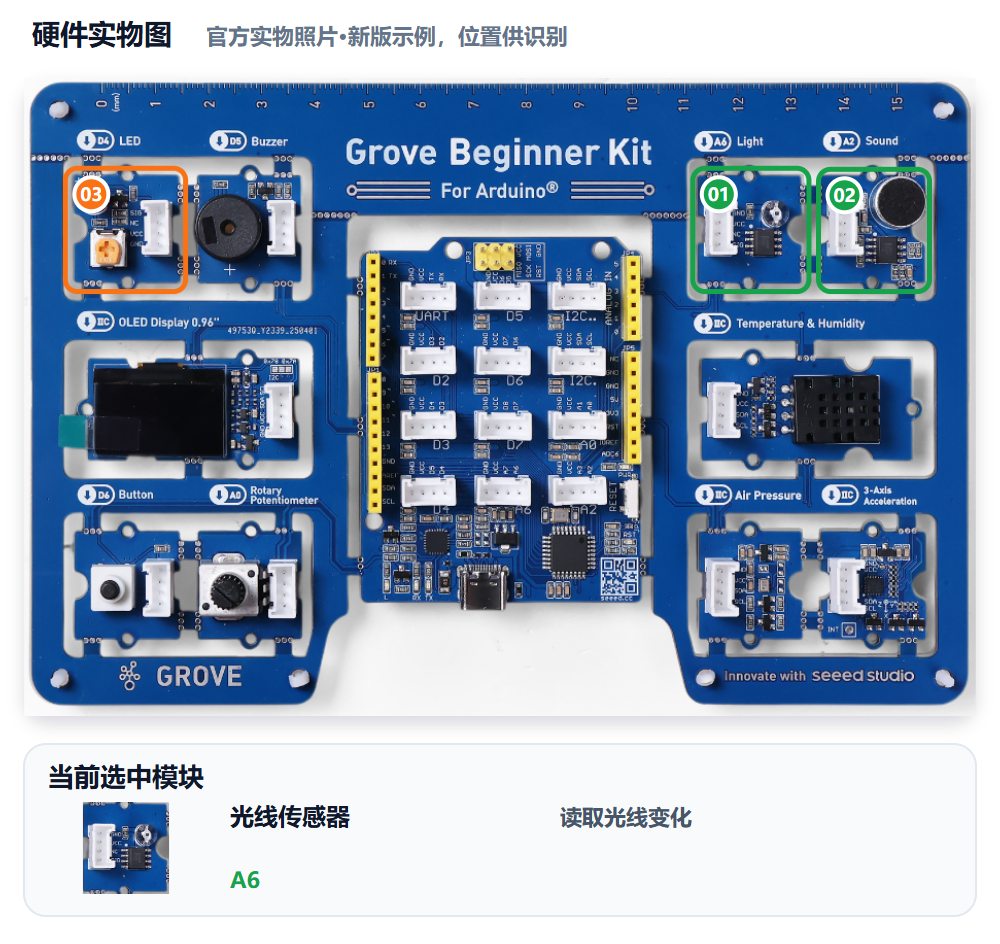
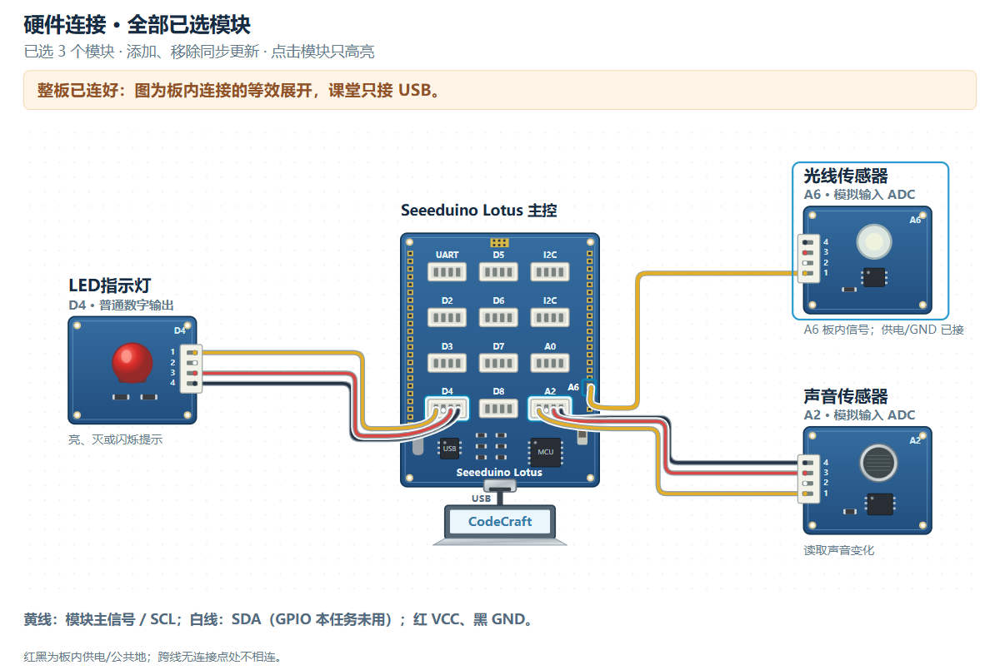

# M05｜给守护者装上耳朵 · V1.0统一教学版

章节：第二章 守护者感知　建议时间：25分钟（未试教计时）

基础功能模块：**光线＋声音＋LED**　[主课件](../教学课件.pptx)：**第24—25页**

[本关网页](../../../web/part2/Part2_AI_Guardian_MissionCenter_V0.4.html)仍为Mission Center V0.4；七步可点击回看，步骤/勾选/徽章不代替真实验收。

## 本关硬件对照





完整整板已由PCB预连接，实际只接USB，不拆板或照图外接线。实物图用于认位置，接线图是板内等效展开，不是运行证据。网页默认适应画布完整显示，原尺寸可滚动；点击只高亮、不检测实物，也不改程序。

光线A6、声音A2为模拟ADC输入，LED D4为数字输出。本关固定三模块，声音读数不是已校准分贝；不加入蜂鸣器。

可看[实物图SVG](../教学素材/硬件图/M05_硬件实物图.svg)、[接线SVG](../教学素材/硬件图/M05_板内接线示意.svg)及[接口说明](../教学素材/硬件图/传感器接口与引脚说明.md)。支持程度以实际教室Gate0为准。

## 1. 任务导入

白天同学讲话很正常，普通暗处也未必异常。你们要让“暗光”和“大声”一起决定LED报警，再用四种组合证明规则没有误写成OR。

**本关任务：**先采样声音并确认暗光阈值，只有暗光且声音超过本组阈值才让LED报警，否则恢复正常。

**最低产出：**声音采样与四组合AND记录，以及实际Prompt、完整工程和对应真实记录。

1. 方案设计员用自己的话说本组目标。
2. 硬件验证员复述将看到什么，先约定测试动作。
3. 两人核对本关基础模块和边界；前九关不强制累计所有旧功能。

本组目标与成功标准：________________________________________________

## 2. 准备线索

### 声音Probe：先采样，不报警

```text
请只读取Grove Beginner Kit声音A2的原始读数，按老师已确认的方法输出供记录。不要控制LED，不写报警判断，不新增模块，让我们比较安静和同一发声动作的数据。
```

1. 临时Probe生成、编译、烧录后，安静和明显发声各采样至少三次。
2. 记录范围，选择能区分两者的声音阈值，不把原始值当作分贝。
3. 核对M04暗光方向与阈值仍适合当前环境，需要时补测。
4. 写成“暗光条件 AND 声音超过阈值”；正式控制V1只用光线、声音、LED。

| 线索 | 本组填写 |
|---|---|
| 安静读数范围 |  |
| 同一发声动作及读数范围 |  |
| 声音阈值与依据 |  |
| 暗光方向、阈值及依据 |  |
| LED报警/正常行为 |  |

Probe稿/工程位置：________________；本组AND规则：________________

尚未确认的信息与确认来源：__________________________________________

## 3. 写出自己的提示词

模糊表达：

> 晚上有声音就报警。

表达支架示例，请替换成自己的目的与已确认信息：

```text
我使用Grove Beginner Kit光线A6、声音A2、LED D4。暗光定义为光线【本组方向】阈值【本组数值】，依据【实测范围】；声音超过【本组阈值】才算大声。只有两个条件同时成立时点亮LED，否则关闭。明亮安静、明亮大声、暗光安静都不报警，暗光大声才报警。只用这三模块，给四种组合的真板测试方法。
```

检查问题：

- 两项阈值与光线方向是否有本组采样依据？
- 规则是否为AND，输出是否明确为LED？
- 是否完整写出四种组合，而非只试会报警的一种？

先在编辑框写自己的稿，点击评分后读一条理由、自己补一处；仍需帮助才润色。对比原稿/建议，核对真实值、接口与规则，人工采用后重新评分。六项100分：目标15、硬件15、规则与参数25、输出15、边界10、验证20；表达分数不证明程序或真板成功。

教师配置接口后教练才可用；Key只在当前页面会话、刷新重填，不写入文本。不可用时用本卡检查问题和同伴核对继续CodeCraft。图示/实测字段不保证自动进入评分上下文，关键确认信息写进Prompt，改变版本、模块、数据或规则后重新核对。

本组原稿/实际稿件位置：______________________________________________

评分理由与我先自行补充：____________________________________________

AI建议/采用或保留理由与重评：________________________________________

## 4. CodeCraft生成、编译与烧录V1

如果AI只用声音报警，要明确补回光线条件和AND；保持正确阈值与LED接口。

1. 确认Part1 Twin或其他读数窗口已释放串口，用USB数据线连接完整板。
2. 使用老师Gate0确认的CodeCraft入口、板卡、连接与库。
3. **另存实际送入CodeCraft的V1 Prompt原文**，标明M05/V1；网页导出不保证是实际V1准确快照。
4. 让CodeCraft生成程序，核对基础模块和关键逻辑；先编译，读取完整结果。
5. 编译通过后烧录，确认写入结果；失败先记录完整错误，不声称真板已运行。
6. 保存V1完整工程/版本，保留后再进入测试或修改。

实际V1 Prompt保存位置：_____________________________________________

V1完整工程/版本位置：________________________________________________

生成：□成功 □失败 □未尝试　编译：□成功 □失败 □未尝试

烧录：□成功 □失败 □未尝试　完整错误/实际操作：______________________

## 5. 仅做V1真机验证

方案设计员先说预期，硬件验证员操作，一起填写真实观察。**本步不修改参数、不提前做V2，不覆盖第一版。**尚未烧录成功时记录阶段和错误，不填写虚构运行结果。

| 实际动作 | 预期 | V1真实观察 |
|---|---|---|
| 明亮＋安静 | 不报警 |  |
| 明亮＋大声 | 不报警 |  |
| 暗光＋安静 | 不报警 |  |
| 暗光＋大声 | LED报警 |  |

按表顺序记录，解释前三项为何不报警、第四项为何报警；不要把AND测试换成一个“成功了”。

网页原check0等历史勾选须按新版四场景文字人工复核，不能当作本次新验收。逐项留下本组真实结果，不重置或伪造既有进度。

V1原始读数、单位或实际现象：__________________________________________

V1照片/完整错误/真实记录位置：_______________________________________

## 6. 反馈与同动作复测

找出是光线方向、声音阈值还是AND逻辑有差异，每次只改必要的一项。

先选择：□根据问题/目标做V2　□V1已符合且无必要改动，保留V1并重复验证。

保留或修改依据：________________　正确部分要保留：________________

修改/改进示例：V2只调整声音阈值并说明采样依据，光线规则保持；仍按同顺序复测四种组合。

本组这次只修改：____________________________________________________

实际V2 Prompt与完整工程另存位置（保留V1时注明）：____________________

执行方式：将具体反馈交给CodeCraft，只改声明的一项；重新编译、烧录并记录结果，再用第5步的同一动作复测。保留V1时不虚构新版本，重复原动作记录。

完成V2实验后回到网页既有复测栏回填，并明确标记轮次；栏位位置不改变实验顺序。网页第6步返回仍会回到第5步，不代表必须重新做一遍V1。

V2生成/编译/烧录结果及完整错误（如适用）：____________________________

| 与第5步相同的动作 | 复测结果（V2或保留V1） |
|---|---|
| 明亮＋安静 |  |
| 明亮＋大声 |  |
| 暗光＋安静 |  |
| 暗光＋大声 |  |

相对V1的变化/保留结论：______________________________________________

## 7. 保存成果与讲解

- 怎样用四组合发现AND被写成OR？
- 声阈值由哪组数据决定？
- 为什么明亮大声和暗光安静都不报警？

我的发现与判断依据：________________________________________________

□实际使用的V1/V2 Prompt原文已另存（或明确保留V1）

□完整CodeCraft工程与版本已保存　□重新打开核对

□真实读数、现象、错误及复测已保存　□网页日志已导出

保存位置：________________　教师核对：________________　下一关交换角色：□

网页日志不能替代实际稿或完整工程。保留Day1独立成果，Part3可能覆盖板上程序；末20分钟含展示12、总结3、保存并重开5，285为净教学、休息另计。

M06沿用同一触发条件，再学习状态保持与人工确认。
