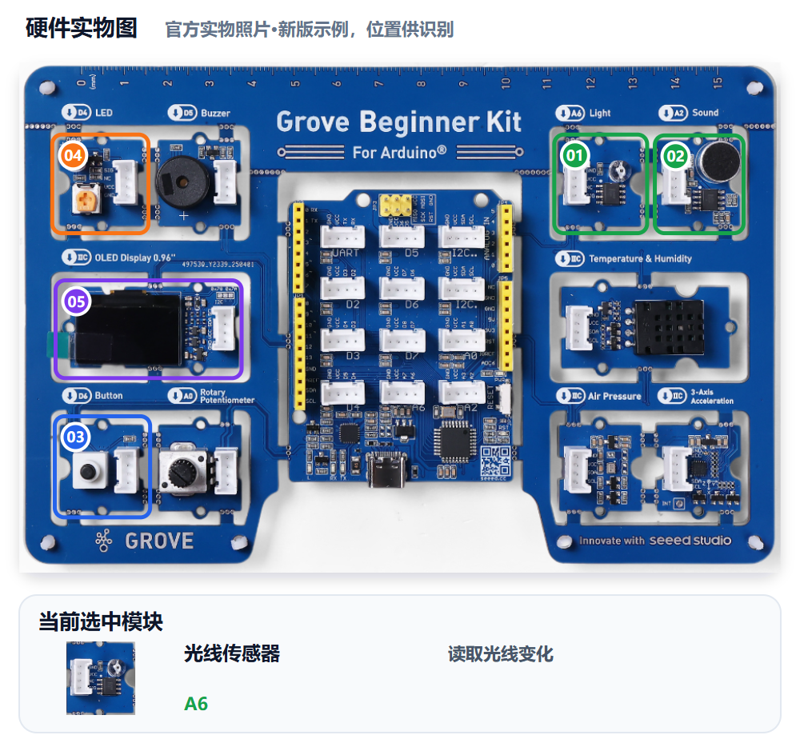
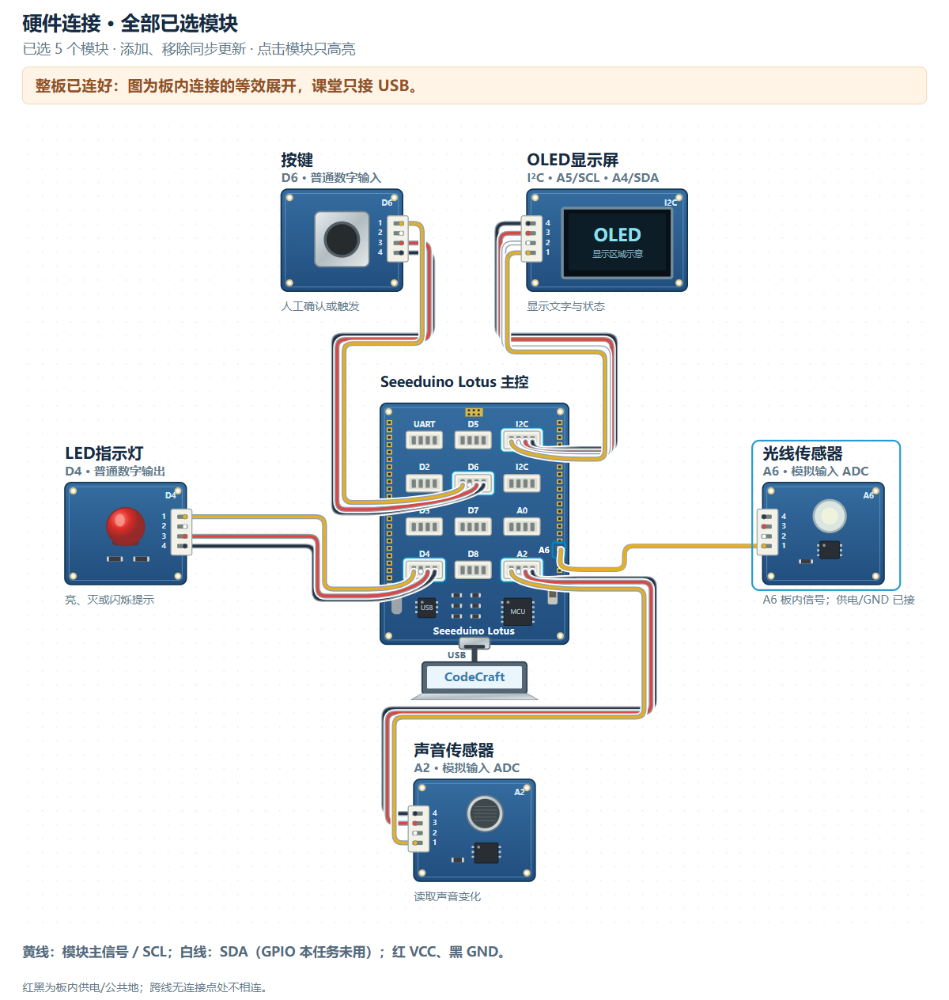

# M06｜让守护者记住警报 · V1.0统一教学版

章节：第二章 守护者感知　建议时间：30分钟（未试教计时）

基础功能模块：**光线＋声音＋LED＋按键＋OLED**　[主课件](../教学课件.pptx)：**第26—28页**

[本关网页](../../../web/part2/Part2_AI_Guardian_MissionCenter_V0.4.html)仍为Mission Center V0.4；七步可点击回看，步骤/勾选/徽章不代替真实验收。

## 本关硬件对照





完整整板已由PCB预连接，实际只接USB，不拆板或照图外接线。实物图用于认位置，接线图是板内等效展开，不是运行证据。网页默认适应画布完整显示，原尺寸可滚动；点击只高亮、不检测实物，也不改程序。

沿用M05光线A6、声音A2的AND触发与实测参数，新增按键D6数字输入和OLED I2C（A4 SDA/A5 SCL），LED D4显示报警。按键读法按Gate0核对。

可看[实物图SVG](../教学素材/硬件图/M06_硬件实物图.svg)、[接线SVG](../教学素材/硬件图/M06_板内接线示意.svg)及[接口说明](../教学素材/硬件图/传感器接口与引脚说明.md)。支持程度以实际教室Gate0为准。

## 1. 任务导入

异常可能只出现几秒，条件消失后值守员仍需知道刚才发生过警报。这一关要记住“发生过”，而不是只看“现在是否异常”。

**本关任务：**触发后进入ALARM并保持，先恢复环境也不自动解除；人工按键后回NORMAL，再制造新异常仍能报警。

**最低产出：**条件/状态链条与四步状态证据，以及实际Prompt、完整工程和对应真实记录。

1. 方案设计员用自己的话说本组目标。
2. 硬件验证员复述将看到什么，先约定测试动作。
3. 两人核对本关基础模块和边界；前九关不强制累计所有旧功能。

本组目标与成功标准：________________________________________________

## 2. 准备线索

先把条件和状态分开。

```text
NORMAL → 暗光且大声触发 → ALARM
光线恢复、声音停止 → 仍ALARM
环境已恢复后按键确认 → NORMAL
再次制造新异常 → 再ALARM
```

1. 把M05已经实测的方向和两项阈值写全，不重新猜。
2. 明确ALARM状态下LED与OLED保持显示，条件消失不清除状态。
3. 基础验收先恢复光线、停止发声，再按键确认。
4. 持续异常时按键属于扩展；若选择，另写策略、按Gate0核对并单独验收。允许再次触发时，按键后又报警不能一概判为故障。

| 线索 | 本组填写 |
|---|---|
| M05触发条件/真实参数 |  |
| NORMAL与ALARM的LED/OLED输出 |  |
| 环境已恢复后的按键确认行为 |  |
| 持续异常按键扩展策略（若选择；未选注明） |  |

尚未确认的信息与确认来源：__________________________________________

## 3. 写出自己的提示词

模糊表达：

> 天黑有声音就报警，按按钮取消。

表达支架示例，请替换成自己的目的与已确认信息：

```text
我使用Grove Beginner Kit光线A6、声音A2、LED D4、按钮D6和OLED I2C。沿用本组M05条件【方向和两项阈值】触发ALARM；触发后LED保持亮、OLED显示ALARM，光线恢复或声音停止也保持。基础先恢复环境后按键确认回NORMAL，之后新异常可再报警。持续异常时按键另写扩展【若选择，写明策略并单独验收】。请区分条件与状态，给恢复环境、保持、确认、再触发的验证动作。
```

检查问题：

- 是否写明条件消失后仍保持ALARM？
- 基础解除是否明确先恢复环境再按键？
- 是否说明新的异常能再次触发；选择持续异常按键扩展时是否另写策略？

先在编辑框写自己的稿，点击评分后读一条理由、自己补一处；仍需帮助才润色。对比原稿/建议，核对真实值、接口与规则，人工采用后重新评分。六项100分：目标15、硬件15、规则与参数25、输出15、边界10、验证20；表达分数不证明程序或真板成功。

教师配置接口后教练才可用；Key只在当前页面会话、刷新重填，不写入文本。不可用时用本卡检查问题和同伴核对继续CodeCraft。图示/实测字段不保证自动进入评分上下文，关键确认信息写进Prompt，改变版本、模块、数据或规则后重新核对。

本组原稿/实际稿件位置：______________________________________________

评分理由与我先自行补充：____________________________________________

AI建议/采用或保留理由与重评：________________________________________

## 4. CodeCraft生成、编译与烧录V1

可能立即再报警时先核对条件是否仍成立和既定策略，不把它直接说成按钮坏了。

1. 确认Part1 Twin或其他读数窗口已释放串口，用USB数据线连接完整板。
2. 使用老师Gate0确认的CodeCraft入口、板卡、连接与库。
3. **另存实际送入CodeCraft的V1 Prompt原文**，标明M06/V1；网页导出不保证是实际V1准确快照。
4. 让CodeCraft生成程序，核对基础模块和关键逻辑；先编译，读取完整结果。
5. 编译通过后烧录，确认写入结果；失败先记录完整错误，不声称真板已运行。
6. 保存V1完整工程/版本，保留后再进入测试或修改。

实际V1 Prompt保存位置：_____________________________________________

V1完整工程/版本位置：________________________________________________

生成：□成功 □失败 □未尝试　编译：□成功 □失败 □未尝试

烧录：□成功 □失败 □未尝试　完整错误/实际操作：______________________

## 5. 仅做V1真机验证

方案设计员先说预期，硬件验证员操作，一起填写真实观察。**本步不修改参数、不提前做V2，不覆盖第一版。**尚未烧录成功时记录阶段和错误，不填写虚构运行结果。

| 实际动作 | 预期 | V1真实观察 |
|---|---|---|
| 制造暗光且大声条件 | LED/OLED进入ALARM |  |
| 恢复光线并停止发声，不按键 | 仍保持ALARM |  |
| 环境已恢复后按键确认 | 解除警报并回NORMAL |  |
| 再制造新异常 | 能再次进入ALARM |  |

扩展“异常持续时按键”的结果（若选择，未测注明）：________________；按本组声明策略解释，单独验收，不替代基础四步。

V1原始读数、单位或实际现象：__________________________________________

V1照片/完整错误/真实记录位置：_______________________________________

## 6. 反馈与同动作复测

只定位没有保持、确认失败或不能再次触发之一；保留正确触发参数和输出。

先选择：□根据问题/目标做V2　□V1已符合且无必要改动，保留V1并重复验证。

保留或修改依据：________________　正确部分要保留：________________

修改/改进示例：V2只修正状态保持逻辑或一个确认边界；基础四步全部重新测试，策略改变则另复测持续异常场景。

本组这次只修改：____________________________________________________

实际V2 Prompt与完整工程另存位置（保留V1时注明）：____________________

执行方式：将具体反馈交给CodeCraft，只改声明的一项；重新编译、烧录并记录结果，再用第5步的同一动作复测。保留V1时不虚构新版本，重复原动作记录。

完成V2实验后回到网页既有复测栏回填，并明确标记轮次；栏位位置不改变实验顺序。网页第6步返回仍会回到第5步，不代表必须重新做一遍V1。

V2生成/编译/烧录结果及完整错误（如适用）：____________________________

| 与第5步相同的动作 | 复测结果（V2或保留V1） |
|---|---|
| 制造暗光且大声条件 |  |
| 恢复光线并停止发声，不按键 |  |
| 环境已恢复后按键确认 |  |
| 再制造新异常 |  |

相对V1的变化/保留结论：______________________________________________

## 7. 保存成果与讲解

- 条件和状态有什么不同？
- 为什么基础验收先恢复环境再按键？
- 条件持续时可能再报警说明什么？

我的发现与判断依据：________________________________________________

□实际使用的V1/V2 Prompt原文已另存（或明确保留V1）

□完整CodeCraft工程与版本已保存　□重新打开核对

□真实读数、现象、错误及复测已保存　□网页日志已导出

保存位置：________________　教师核对：________________　下一关交换角色：□

网页日志不能替代实际稿或完整工程。保留Day1独立成果，Part3可能覆盖板上程序；末20分钟含展示12、总结3、保存并重开5，285为净教学、休息另计。

M07改做即时阈值调节，不沿用本关锁存、按钮或光线条件。
