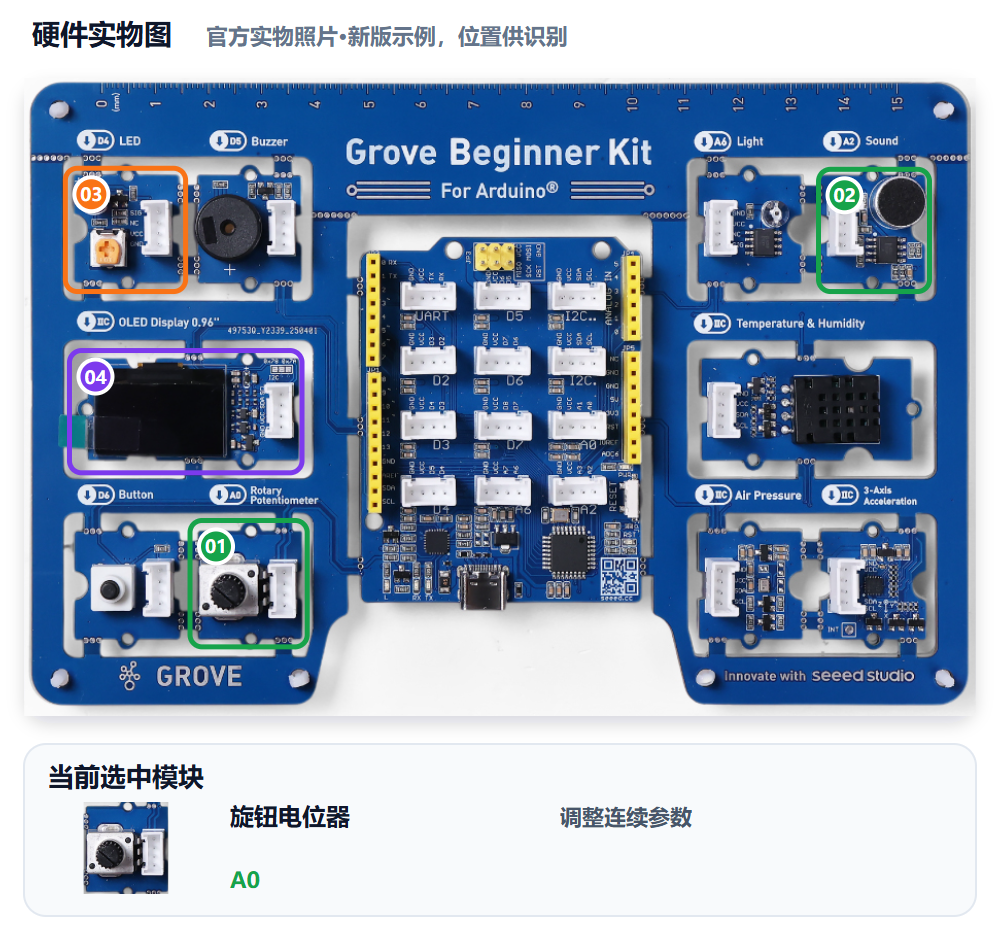
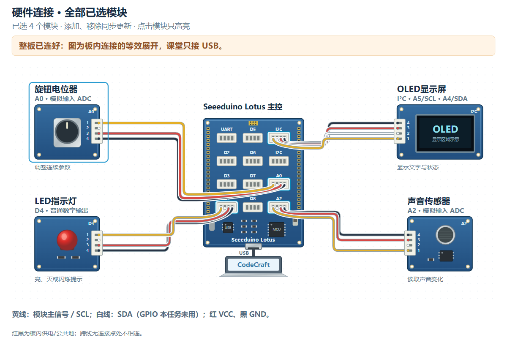

# M07｜调整警戒等级 · V1.0统一教学版

章节：第二章 守护者感知　建议时间：20分钟（未试教计时）

基础功能模块：**旋钮＋声音＋LED＋OLED**　[主课件](../教学课件.pptx)：**第29—30页**

[本关网页](../../../web/part2/Part2_AI_Guardian_MissionCenter_V0.4.html)仍为Mission Center V0.4；七步可点击回看，步骤/勾选/徽章不代替真实验收。

## 本关硬件对照





完整整板已由PCB预连接，实际只接USB，不拆板或照图外接线。实物图用于认位置，接线图是板内等效展开，不是运行证据。网页默认适应画布完整显示，原尺寸可滚动；点击只高亮、不检测实物，也不改程序。

旋钮A0、声音A2为ADC，LED D4数字输出，OLED I2C A4 SDA/A5 SCL。基础不锁存，不沿用M06按键或光线条件；旋钮是电位器，不是编码器。

可看[实物图SVG](../教学素材/硬件图/M07_硬件实物图.svg)、[接线SVG](../教学素材/硬件图/M07_板内接线示意.svg)及[接口说明](../教学素材/硬件图/传感器接口与引脚说明.md)。支持程度以实际教室Gate0为准。

## 1. 任务导入

值守员需要现场调灵敏度，而不是每次重写程序。你们要让旋钮调整声音阈值，屏幕显示该阈值，同一个声音在低高阈值下有可比较的结果。

**本关任务：**旋钮映射为声音阈值，OLED显示实际比较的当前值；LED按当前声音条件即时报警，恢复安静即回正常，不锁存。

**最低产出：**同声音下低高阈值与即时LED对照，以及实际Prompt、完整工程和对应真实记录。

1. 方案设计员用自己的话说本组目标。
2. 硬件验证员复述将看到什么，先约定测试动作。
3. 两人核对本关基础模块和边界；前九关不强制累计所有旧功能。

本组目标与成功标准：________________________________________________

## 2. 准备线索

写清参数链条：旋钮输入→当前声音阈值→OLED显示→LED即时比较。

1. 沿用已确认的声音采样依据，选择合适映射范围，不直接抄200—800。
2. 明确旋钮转向与阈值变化，显示值与判断值必须相同。
3. 低高阈值用同一距离、同一方式发声比较，一次只改变阈值。
4. 不加入光线AND、按键确认或ALARM锁存，声音不满足时LED恢复正常。

| 线索 | 本组填写 |
|---|---|
| 声音读数依据/范围 |  |
| 旋钮映射范围与方向 |  |
| OLED显示格式 |  |
| 统一发声动作与距离 |  |

尚未确认的信息与确认来源：__________________________________________

## 3. 写出自己的提示词

模糊表达：

> 用旋钮控制报警。

表达支架示例，请替换成自己的目的与已确认信息：

```text
我使用Grove Beginner Kit旋钮A0、声音A2、LED D4和OLED I2C。旋钮映射声音阈值【范围与方向，来自采样】；OLED持续显示同一个当前阈值。声音超过当前阈值时LED亮，否则灭，不锁存，不加入按钮或光线条件。用同一个发声动作比较低高阈值，并检查恢复安静后正常。
```

检查问题：

- 范围、方向与控制对象是否明确？
- 显示阈值与实际比较值是否相同？
- 是否明确即时报警、不锁存、无按钮/光线继承？

先在编辑框写自己的稿，点击评分后读一条理由、自己补一处；仍需帮助才润色。对比原稿/建议，核对真实值、接口与规则，人工采用后重新评分。六项100分：目标15、硬件15、规则与参数25、输出15、边界10、验证20；表达分数不证明程序或真板成功。

教师配置接口后教练才可用；Key只在当前页面会话、刷新重填，不写入文本。不可用时用本卡检查问题和同伴核对继续CodeCraft。图示/实测字段不保证自动进入评分上下文，关键确认信息写进Prompt，改变版本、模块、数据或规则后重新核对。

本组原稿/实际稿件位置：______________________________________________

评分理由与我先自行补充：____________________________________________

AI建议/采用或保留理由与重评：________________________________________

## 4. CodeCraft生成、编译与烧录V1

若AI沿用了M06保持状态，明确删除该继承；否则两轮声音结果无法公平比较。

1. 确认Part1 Twin或其他读数窗口已释放串口，用USB数据线连接完整板。
2. 使用老师Gate0确认的CodeCraft入口、板卡、连接与库。
3. **另存实际送入CodeCraft的V1 Prompt原文**，标明M07/V1；网页导出不保证是实际V1准确快照。
4. 让CodeCraft生成程序，核对基础模块和关键逻辑；先编译，读取完整结果。
5. 编译通过后烧录，确认写入结果；失败先记录完整错误，不声称真板已运行。
6. 保存V1完整工程/版本，保留后再进入测试或修改。

实际V1 Prompt保存位置：_____________________________________________

V1完整工程/版本位置：________________________________________________

生成：□成功 □失败 □未尝试　编译：□成功 □失败 □未尝试

烧录：□成功 □失败 □未尝试　完整错误/实际操作：______________________

## 5. 仅做V1真机验证

方案设计员先说预期，硬件验证员操作，一起填写真实观察。**本步不修改参数、不提前做V2，不覆盖第一版。**尚未烧录成功时记录阶段和错误，不填写虚构运行结果。

| 实际动作 | 预期 | V1真实观察 |
|---|---|---|
| 慢转旋钮并观察OLED | 阈值按声明方向变化，接近本组范围 |  |
| 同一声音动作，分别使用低和高阈值 | 能对照阈值解释LED即时结果 |  |
| 恢复安静再观察 | LED回正常，不保持上次警报 |  |
| 核对显示值与判断所用阈值 | 两者一致 |  |


V1原始读数、单位或实际现象：__________________________________________

V1照片/完整错误/真实记录位置：_______________________________________

## 6. 反馈与同动作复测

只改映射范围、显示格式或即时比较中的一项，依据真实对照说明误报/漏报或不一致。

先选择：□根据问题/目标做V2　□V1已符合且无必要改动，保留V1并重复验证。

保留或修改依据：________________　正确部分要保留：________________

修改/改进示例：V2只调整有依据的映射范围；保留四模块和不锁存边界，重复同声音低高比较及安静恢复。

本组这次只修改：____________________________________________________

实际V2 Prompt与完整工程另存位置（保留V1时注明）：____________________

执行方式：将具体反馈交给CodeCraft，只改声明的一项；重新编译、烧录并记录结果，再用第5步的同一动作复测。保留V1时不虚构新版本，重复原动作记录。

完成V2实验后回到网页既有复测栏回填，并明确标记轮次；栏位位置不改变实验顺序。网页第6步返回仍会回到第5步，不代表必须重新做一遍V1。

V2生成/编译/烧录结果及完整错误（如适用）：____________________________

| 与第5步相同的动作 | 复测结果（V2或保留V1） |
|---|---|
| 慢转旋钮并观察OLED |  |
| 同一声音动作，分别使用低和高阈值 |  |
| 恢复安静再观察 |  |
| 核对显示值与判断所用阈值 |  |

相对V1的变化/保留结论：______________________________________________

## 7. 保存成果与讲解

- 为什么两轮必须用同一种声音动作？
- 低阈值与高阈值各可能有什么取舍？
- 不锁存与M06保持状态有什么区别？

我的发现与判断依据：________________________________________________

□实际使用的V1/V2 Prompt原文已另存（或明确保留V1）

□完整CodeCraft工程与版本已保存　□重新打开核对

□真实读数、现象、错误及复测已保存　□网页日志已导出

保存位置：________________　教师核对：________________　下一关交换角色：□

网页日志不能替代实际稿或完整工程。保留Day1独立成果，Part3可能覆盖板上程序；末20分钟含展示12、总结3、保存并重开5，285为净教学、休息另计。

第三章先确认环境模块版本和库，再读取多类数据。
