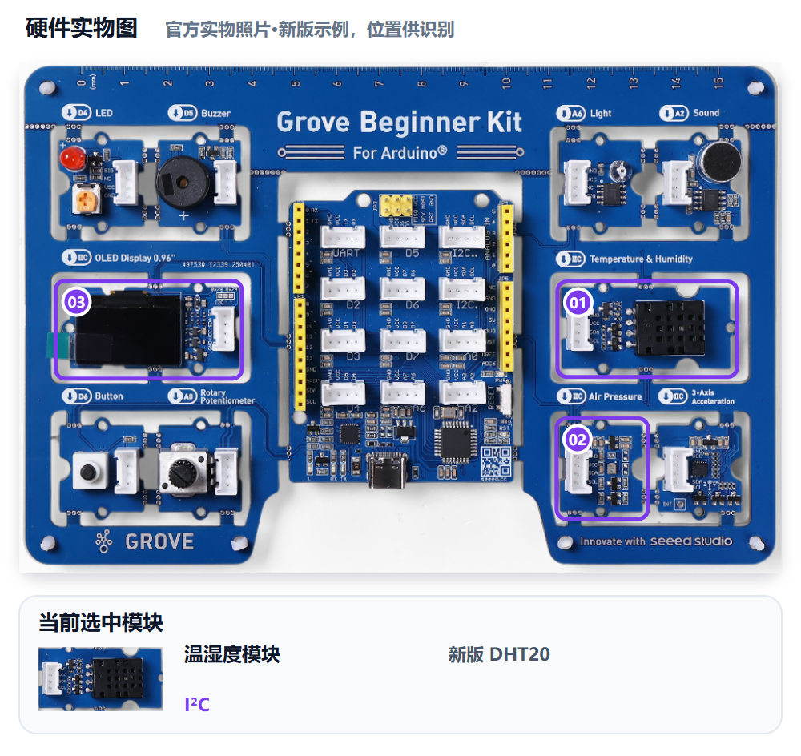
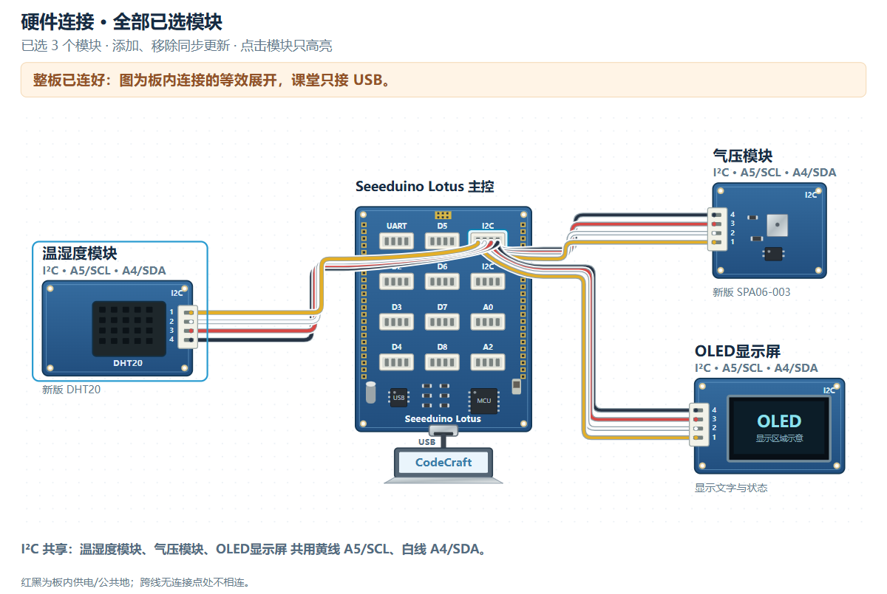

# M08｜环境守护 · V1.0统一教学版

章节：第三章 守护者进阶　建议时间：20分钟（未试教计时）

基础功能模块：**温湿度＋气压＋OLED**　[主课件](../教学课件.pptx)：**第31—32页**

[本关网页](../../../web/part2/Part2_AI_Guardian_MissionCenter_V0.4.html)仍为Mission Center V0.4；七步可点击回看，步骤/勾选/徽章不代替真实验收。

## 本关硬件对照





完整整板已由PCB预连接，实际只接USB，不拆板或照图外接线。实物图用于认位置，接线图是板内等效展开，不是运行证据。网页默认适应画布完整显示，原尺寸可滚动；点击只高亮、不检测实物，也不改程序。

旧DHT11是D3单线数字时序，新DHT20走I2C；BMP280/SPA06-003与OLED在本套件走I2C，共用A4 SDA/A5 SCL。实板版本先确认，未知不猜信号线或库。

可看[实物图SVG](../教学素材/硬件图/M08_硬件实物图.svg)、[接线SVG](../教学素材/硬件图/M08_板内接线示意.svg)及[接口说明](../教学素材/硬件图/传感器接口与引脚说明.md)。支持程度以实际教室Gate0为准。

## 1. 任务导入

环境数据变化慢，几次刷新看起来相同也可能是正常。你们要先认清传感器版本，再让OLED给出标签、单位和清楚的刷新节奏，而不是看见数字就算成功。

**本关任务：**确认真实温湿度/气压型号及对应库后才做V1；OLED显示温度、湿度、气压及正确单位，并按本组间隔刷新。

**最低产出：**版本依据、三类数值/单位和刷新记录，以及实际Prompt、完整工程和对应真实记录。

1. 方案设计员用自己的话说本组目标。
2. 硬件验证员复述将看到什么，先约定测试动作。
3. 两人核对本关基础模块和边界；前九关不强制累计所有旧功能。

本组目标与成功标准：________________________________________________

## 2. 准备线索

### 版本确认：先锁定硬件，再做V1

```text
我使用Grove Beginner Kit，但温湿度/气压型号尚需确认。请先列出DHT11或DHT20、BMP280或SPA06-003及对应库需要确认的信息，不要猜库或生成未确认版本的控制V1。确认后再请求最小读取程序。
```

1. 查看实板标识、课堂资料及Gate0记录，分别确认两个模块和库。
2. 未知时停在确认步骤，不先烧录某个猜测版。
3. 写清温度、湿度、气压的标签、单位依据和刷新间隔。
4. 多次观察刷新，允许真实环境值相同，不编造变化。

| 本组版本 | 图示对照 | 下一步 |
|---|---|---|
| 旧DHT11＋BMP280 | [旧版PNG](../教学素材/硬件图/PNG预览/M08_旧版_板内接线示意.png) | 核对D3时序与I2C库 |
| 新DHT20＋SPA06-003 | [新版PNG](../教学素材/硬件图/PNG预览/M08_新版_板内接线示意.png) | 核对I2C库 |
| 待确认 | [待确认PNG](../教学素材/硬件图/PNG预览/M08_版本待确认_板内接线示意.png) | 先补信息，暂不做V1 |

本组温湿度型号/库：________________　气压型号/库：________________

确认来源：________________　单位依据：________________　刷新间隔：________________

尚未确认的信息与确认来源：__________________________________________

## 3. 写出自己的提示词

模糊表达：

> 显示温湿度和气压。

表达支架示例，请替换成自己的目的与已确认信息：

```text
本组Grove Beginner Kit已经确认温湿度为【型号/库/接口】，气压为【型号/库】，依据【实板和Gate0来源】。请读取温度、湿度、气压，在OLED显示【标签及确认的单位】，每【本组间隔】刷新。只用这三模块，若型号/单位仍有缺项先说明，不能猜。给数次刷新与库匹配的验证步骤。
```

检查问题：

- 两个真实型号与库是否在V1之前确认？
- 是否有三类数据的标签、单位依据和刷新间隔？
- 是否知道相同读数不必然表示停止刷新？

先在编辑框写自己的稿，点击评分后读一条理由、自己补一处；仍需帮助才润色。对比原稿/建议，核对真实值、接口与规则，人工采用后重新评分。六项100分：目标15、硬件15、规则与参数25、输出15、边界10、验证20；表达分数不证明程序或真板成功。

教师配置接口后教练才可用；Key只在当前页面会话、刷新重填，不写入文本。不可用时用本卡检查问题和同伴核对继续CodeCraft。图示/实测字段不保证自动进入评分上下文，关键确认信息写进Prompt，改变版本、模块、数据或规则后重新核对。

本组原稿/实际稿件位置：______________________________________________

评分理由与我先自行补充：____________________________________________

AI建议/采用或保留理由与重评：________________________________________

## 4. CodeCraft生成、编译与烧录V1

生成代码所用库要与已确认实板一致；版本未知不进入V1，不用未确认烧录作V2例子。

1. 确认Part1 Twin或其他读数窗口已释放串口，用USB数据线连接完整板。
2. 使用老师Gate0确认的CodeCraft入口、板卡、连接与库。
3. **另存实际送入CodeCraft的V1 Prompt原文**，标明M08/V1；网页导出不保证是实际V1准确快照。
4. 让CodeCraft生成程序，核对基础模块和关键逻辑；先编译，读取完整结果。
5. 编译通过后烧录，确认写入结果；失败先记录完整错误，不声称真板已运行。
6. 保存V1完整工程/版本，保留后再进入测试或修改。

实际V1 Prompt保存位置：_____________________________________________

V1完整工程/版本位置：________________________________________________

生成：□成功 □失败 □未尝试　编译：□成功 □失败 □未尝试

烧录：□成功 □失败 □未尝试　完整错误/实际操作：______________________

## 5. 仅做V1真机验证

方案设计员先说预期，硬件验证员操作，一起填写真实观察。**本步不修改参数、不提前做V2，不覆盖第一版。**尚未烧录成功时记录阶段和错误，不填写虚构运行结果。

| 实际动作 | 预期 | V1真实观察 |
|---|---|---|
| 核对程序使用的型号/库与实板记录 | 一致，未知项先补确认 |  |
| 观察三类数值、标签和单位 | 温度/湿度/气压可区分，单位有来源 |  |
| 记录至少三次刷新和间隔 | 节奏符合要求，真实值相同也如实记录 |  |


V1原始读数、单位或实际现象：__________________________________________

V1照片/完整错误/真实记录位置：_______________________________________

## 6. 反馈与同动作复测

若AI生成库与已确认型号不符，只修正库选择；版本正确时再考虑标签或刷新间隔。

先选择：□根据问题/目标做V2　□V1已符合且无必要改动，保留V1并重复验证。

保留或修改依据：________________　正确部分要保留：________________

修改/改进示例：V2只修正与已确认实板不符的库，或只改刷新间隔/标签之一；不是把未确认硬件先烧录再补确认。

本组这次只修改：____________________________________________________

实际V2 Prompt与完整工程另存位置（保留V1时注明）：____________________

执行方式：将具体反馈交给CodeCraft，只改声明的一项；重新编译、烧录并记录结果，再用第5步的同一动作复测。保留V1时不虚构新版本，重复原动作记录。

完成V2实验后回到网页既有复测栏回填，并明确标记轮次；栏位位置不改变实验顺序。网页第6步返回仍会回到第5步，不代表必须重新做一遍V1。

V2生成/编译/烧录结果及完整错误（如适用）：____________________________

| 与第5步相同的动作 | 复测结果（V2或保留V1） |
|---|---|
| 核对程序使用的型号/库与实板记录 |  |
| 观察三类数值、标签和单位 |  |
| 记录至少三次刷新和间隔 |  |

相对V1的变化/保留结论：______________________________________________

## 7. 保存成果与讲解

- 为什么硬件确认必须在V1之前？
- 环境值相同时怎样确认程序仍在刷新？
- 气压单位来自哪里，哪些信息仍未知？

我的发现与判断依据：________________________________________________

□实际使用的V1/V2 Prompt原文已另存（或明确保留V1）

□完整CodeCraft工程与版本已保存　□重新打开核对

□真实读数、现象、错误及复测已保存　□网页日志已导出

保存位置：________________　教师核对：________________　下一关交换角色：□

网页日志不能替代实际稿或完整工程。保留Day1独立成果，Part3可能覆盖板上程序；末20分钟含展示12、总结3、保存并重开5，285为净教学、休息另计。

M09先确认XYZ返回单位，再用平放与倾斜读数设计规则。
