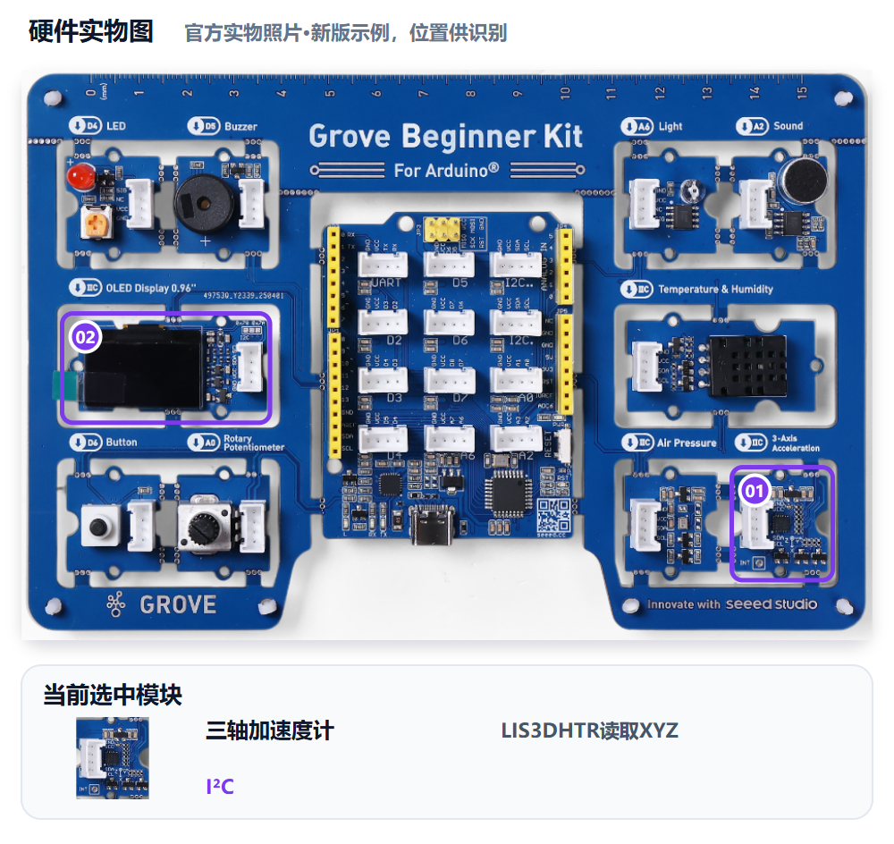
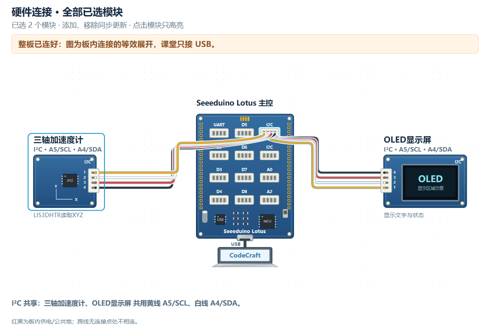

# M09｜姿态守护 · V1.0统一教学版

章节：第三章 守护者进阶　建议时间：20分钟（未试教计时）

基础功能模块：**加速度＋OLED**　[主课件](../教学课件.pptx)：**第33—34页**

[本关网页](../../../web/part2/Part2_AI_Guardian_MissionCenter_V0.4.html)仍为Mission Center V0.4；七步可点击回看，步骤/勾选/徽章不代替真实验收。

## 本关硬件对照





完整整板已由PCB预连接，实际只接USB，不拆板或照图外接线。实物图用于认位置，接线图是板内等效展开，不是运行证据。网页默认适应画布完整显示，原尺寸可滚动；点击只高亮、不检测实物，也不改程序。

LIS3DHTR与OLED走I2C，共用A4 SDA/A5 SCL；返回单位/范围按已确认库核对。不能单独测Yaw，不能作为建筑安全检测。

可看[实物图SVG](../教学素材/硬件图/M09_硬件实物图.svg)、[接线SVG](../教学素材/硬件图/M09_板内接线示意.svg)及[接口说明](../教学素材/硬件图/传感器接口与引脚说明.md)。支持程度以实际教室Gate0为准。

## 1. 任务导入

轻托模型倾斜时，加速度计给出XYZ数据，不会直接说“发生什么事件”。你们需要先看单位和基线，再决定怎样把读数变成NORMAL/TILT规则。

**本关任务：**先记录XYZ单位、平放和倾斜数据，再选择有依据的比较量与阈值；OLED显示状态，恢复平放后回正常。

**最低产出：**单位、XYZ基线/倾斜记录、状态规则及恢复，以及实际Prompt、完整工程和对应真实记录。

1. 方案设计员用自己的话说本组目标。
2. 硬件验证员复述将看到什么，先约定测试动作。
3. 两人核对本关基础模块和边界；前九关不强制累计所有旧功能。

本组目标与成功标准：________________________________________________

## 2. 准备线索

### XYZ Probe：先观察，不报警

```text
请只读取Grove Beginner Kit的LIS3DHTR XYZ，说明已确认库返回单位/范围，并按课堂支持方式显示原始值。不要先写倾斜报警，不声称能单独测Yaw或判断建筑安全。
```

1. 确认库与返回单位/范围，再生成、编译、烧录临时Probe。
2. 平放记录XYZ基线，轻托缓慢向同一方向倾斜，再恢复。
3. 根据真实变化选择轴/比较量、比较方向与阈值，不把0.7当通用值。
4. 正式V1只用加速度和OLED；说清TILT与恢复条件。

| 动作 | X | Y | Z | 单位/范围 |
|---|---|---|---|---|
| 平放 |  |  |  |  |
| 向____倾斜 |  |  |  |  |
| 恢复平放 |  |  |  |  |

库/单位确认来源：________________　比较量、方向、阈值与依据：________________

尚未确认的信息与确认来源：__________________________________________

## 3. 写出自己的提示词

模糊表达：

> 检测板子姿态，倾斜就报警。

表达支架示例，请替换成自己的目的与已确认信息：

```text
我使用Grove Beginner Kit LIS3DHTR和OLED I2C。已确认库/单位为【本组信息】，平放XYZ为【基线】，向【方向】倾斜时【真实变化】。选择【比较量/轴、方向、阈值】显示TILT，否则NORMAL，恢复条件为【本组规则】。只用这两模块，不单独测Yaw，不作为建筑安全检测；给同方向倾斜和恢复的测试步骤。
```

检查问题：

- 单位/范围、平放基线与倾斜数据是否都已记录？
- 比较量、方向、阈值和恢复条件是否有依据？
- 是否明确Yaw与建筑安全边界，而不是夸大功能？

先在编辑框写自己的稿，点击评分后读一条理由、自己补一处；仍需帮助才润色。对比原稿/建议，核对真实值、接口与规则，人工采用后重新评分。六项100分：目标15、硬件15、规则与参数25、输出15、边界10、验证20；表达分数不证明程序或真板成功。

教师配置接口后教练才可用；Key只在当前页面会话、刷新重填，不写入文本。不可用时用本卡检查问题和同伴核对继续CodeCraft。图示/实测字段不保证自动进入评分上下文，关键确认信息写进Prompt，改变版本、模块、数据或规则后重新核对。

本组原稿/实际稿件位置：______________________________________________

评分理由与我先自行补充：____________________________________________

AI建议/采用或保留理由与重评：________________________________________

## 4. CodeCraft生成、编译与烧录V1

单位不明先核对库，不能直接套0.7；测试轻托缓慢倾斜，不甩板或拉线。

1. 确认Part1 Twin或其他读数窗口已释放串口，用USB数据线连接完整板。
2. 使用老师Gate0确认的CodeCraft入口、板卡、连接与库。
3. **另存实际送入CodeCraft的V1 Prompt原文**，标明M09/V1；网页导出不保证是实际V1准确快照。
4. 让CodeCraft生成程序，核对基础模块和关键逻辑；先编译，读取完整结果。
5. 编译通过后烧录，确认写入结果；失败先记录完整错误，不声称真板已运行。
6. 保存V1完整工程/版本，保留后再进入测试或修改。

实际V1 Prompt保存位置：_____________________________________________

V1完整工程/版本位置：________________________________________________

生成：□成功 □失败 □未尝试　编译：□成功 □失败 □未尝试

烧录：□成功 □失败 □未尝试　完整错误/实际操作：______________________

## 5. 仅做V1真机验证

方案设计员先说预期，硬件验证员操作，一起填写真实观察。**本步不修改参数、不提前做V2，不覆盖第一版。**尚未烧录成功时记录阶段和错误，不填写虚构运行结果。

| 实际动作 | 预期 | V1真实观察 |
|---|---|---|
| 平放并观察XYZ和状态 | 基线可记录，状态符合正常规则 |  |
| 向同一方向缓慢倾斜 | 数据满足本组规则时显示TILT |  |
| 恢复平放 | 状态回NORMAL或已声明正常状态 |  |
| 口头解释能力边界 | 不能单独测Yaw，不给建筑安全结论 |  |


V1原始读数、单位或实际现象：__________________________________________

V1照片/完整错误/真实记录位置：_______________________________________

## 6. 反馈与同动作复测

依据真实基线和倾斜观察，只改判断量/轴、阈值或显示中的一项，单位与接口保持正确。

先选择：□根据问题/目标做V2　□V1已符合且无必要改动，保留V1并重复验证。

保留或修改依据：________________　正确部分要保留：________________

修改/改进示例：V2只调整有依据的判断轴或阈值之一；同方向、同动作倾斜并恢复，保留原始读数对照。

本组这次只修改：____________________________________________________

实际V2 Prompt与完整工程另存位置（保留V1时注明）：____________________

执行方式：将具体反馈交给CodeCraft，只改声明的一项；重新编译、烧录并记录结果，再用第5步的同一动作复测。保留V1时不虚构新版本，重复原动作记录。

完成V2实验后回到网页既有复测栏回填，并明确标记轮次；栏位位置不改变实验顺序。网页第6步返回仍会回到第5步，不代表必须重新做一遍V1。

V2生成/编译/烧录结果及完整错误（如适用）：____________________________

| 与第5步相同的动作 | 复测结果（V2或保留V1） |
|---|---|
| 平放并观察XYZ和状态 |  |
| 向同一方向缓慢倾斜 |  |
| 恢复平放 |  |
| 口头解释能力边界 |  |

相对V1的变化/保留结论：______________________________________________

## 7. 保存成果与讲解

- XYZ数字为什么不等于姿态名称？
- 为什么单位确认在阈值选择之前？
- 你们怎样用恢复动作排除只会触发不会恢复？

我的发现与判断依据：________________________________________________

□实际使用的V1/V2 Prompt原文已另存（或明确保留V1）

□完整CodeCraft工程与版本已保存　□重新打开核对

□真实读数、现象、错误及复测已保存　□网页日志已导出

保存位置：________________　教师核对：________________　下一关交换角色：□

网页日志不能替代实际稿或完整工程。保留Day1独立成果，Part3可能覆盖板上程序；末20分钟含展示12、总结3、保存并重开5，285为净教学、休息另计。

M10撤去成品系统模板，本组自主描述至少三个功能模块协作。
