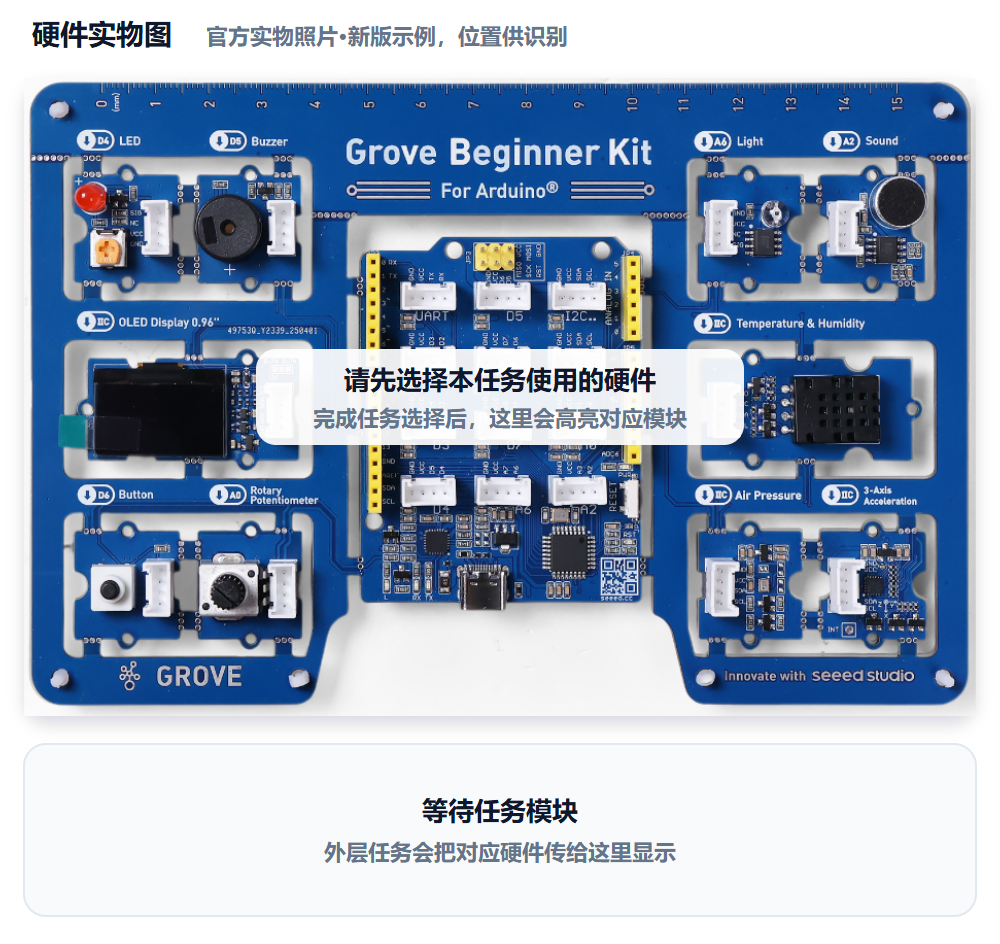
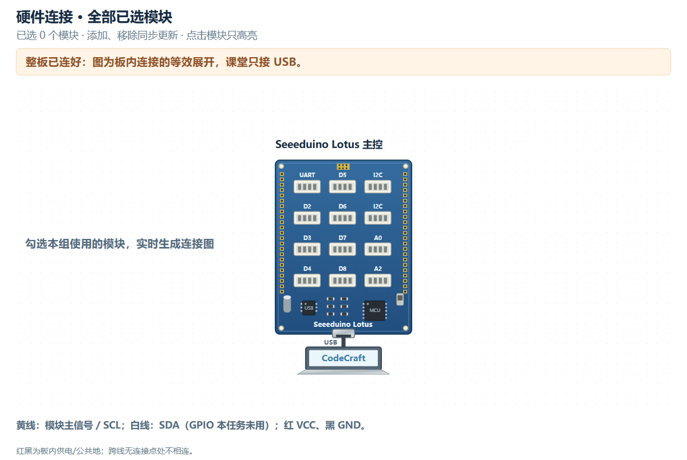

# M10｜完整守护者挑战 · V1.0统一教学版

章节：第三章 守护者进阶　建议时间：30分钟（未试教计时）

基础功能模块：**自主选择至少3个功能模块协作**　[主课件](../教学课件.pptx)：**第35—36页**

[本关网页](../../../web/part2/Part2_AI_Guardian_MissionCenter_V0.4.html)仍为Mission Center V0.4；七步可点击回看，步骤/勾选/徽章不代替真实验收。

## 本关硬件对照





完整整板已由PCB预连接，实际只接USB，不拆板或照图外接线。实物图用于认位置，接线图是板内等效展开，不是运行证据。网页默认适应画布完整显示，原尺寸可滚动；点击只高亮、不检测实物，也不改程序。

从整板功能模块池自选：OLED、LED、蜂鸣器、光线、声音、按键、旋钮、温湿度、气压、加速度。主控和USB不计入模块数，温湿度两个读数仍算一个模块；按确认接口写入Prompt。

可看[实物图SVG](../教学素材/硬件图/M10_硬件实物图.svg)、[接线SVG](../教学素材/硬件图/M10_板内接线示意.svg)及[接口说明](../教学素材/硬件图/传感器接口与引脚说明.md)。支持程度以实际教室Gate0为准。

## 1. 任务导入

这一次由你们提出完整值守需求，方案设计员像项目负责人组织方案，硬件验证员设计可复测的场景。要证明模块在同一套规则或数据显示中配合，而不是各做各的演示。

**本关任务：**自主写出至少3个功能模块协作的完整系统Prompt，做V1真板测试，再完成一次有目的的V2与同动作复测。

**最低产出：**自主完整需求、协作证据、有目的V2和独立工程，以及实际Prompt、完整工程和对应真实记录。

1. 方案设计员用自己的话说本组目标。
2. 硬件验证员复述将看到什么，先约定测试动作。
3. 两人核对本关基础模块和边界；前九关不强制累计所有旧功能。

本组目标与成功标准：________________________________________________

## 2. 准备线索

本卡静态图用于认识模块池，不是指定成品方案。网页中自行选择后看本组图，完整需求仍自己写。

1. 列至少三个功能模块，并说明输入、调节或输出作用。
2. 用一条协作链说明哪个数据或动作影响哪个输出，不能只是三个独立循环。
3. 写明规则、恢复/边界及本关不做的功能；实际型号、单位和阈值来自已确认记录。
4. 设计适配方案的应触发、不应触发及恢复/边界场景；触发表示所设计的输出变化，不限定为声音报警。
5. 首次符合也要提出有目的改进，M10不能只写保留V1。

| 需求要素 | 本组自主填写 |
|---|---|
| 目标与至少3个功能模块 |  |
| 输入/调节→规则→输出协作链 |  |
| 参数来源、单位与版本 |  |
| 应触发、不应触发与恢复/边界场景 |  |
| 计划关注的改进目标 |  |

尚未确认的信息与确认来源：__________________________________________

## 3. 写出自己的提示词

模糊表达：

> 帮我做一个完整守护者系统。

局部表达示例，不是成品答案：

```text
局部规则表达：当【本组选择的输入/动作】满足【本组确定的规则】时，让【本组选的输出】执行【可观察行为】，恢复或边界为【本组说明】。这只是局部表达，不是完整系统答案；目标、模块、数据、规则、输出和验收都由本组组织。
```

检查问题：

- 功能模块至少三个，主控/USB没有凑数，协作链清楚吗？
- 完整需求包含目标、硬件/输入、规则、输出、边界与验收吗？
- 是否有适配方案的场景，以及一次有目的V2的依据？

先在编辑框写自己的稿，点击评分后读一条理由、自己补一处；仍需帮助才润色。对比原稿/建议，核对真实值、接口与规则，人工采用后重新评分。六项100分：目标15、硬件15、规则与参数25、输出15、边界10、验证20；表达分数不证明程序或真板成功。

教师配置接口后教练才可用；Key只在当前页面会话、刷新重填，不写入文本。不可用时用本卡检查问题和同伴核对继续CodeCraft。图示/实测字段不保证自动进入评分上下文，关键确认信息写进Prompt，改变版本、模块、数据或规则后重新核对。

本组原稿/实际稿件位置：______________________________________________

评分理由与我先自行补充：____________________________________________

AI建议/采用或保留理由与重评：________________________________________

## 4. CodeCraft生成、编译与烧录V1

AI不替你们选择目标、模块或阈值；新增未选模块时回到需求边界核对。

1. 确认Part1 Twin或其他读数窗口已释放串口，用USB数据线连接完整板。
2. 使用老师Gate0确认的CodeCraft入口、板卡、连接与库。
3. **另存实际送入CodeCraft的V1 Prompt原文**，标明M10/V1；网页导出不保证是实际V1准确快照。
4. 让CodeCraft生成程序，核对基础模块和关键逻辑；先编译，读取完整结果。
5. 编译通过后烧录，确认写入结果；失败先记录完整错误，不声称真板已运行。
6. 保存V1完整工程/版本，保留后再进入测试或修改。

实际V1 Prompt保存位置：_____________________________________________

V1完整工程/版本位置：________________________________________________

生成：□成功 □失败 □未尝试　编译：□成功 □失败 □未尝试

烧录：□成功 □失败 □未尝试　完整错误/实际操作：______________________

## 5. 仅做V1真机验证

方案设计员先说预期，硬件验证员操作，一起填写真实观察。**本步不修改参数、不提前做V2，不覆盖第一版。**尚未烧录成功时记录阶段和错误，不填写虚构运行结果。

| 实际动作 | 预期 | V1真实观察 |
|---|---|---|
| 检查本组实际选用功能模块与协作链 | 至少3个功能模块配合，主控/USB不计 |  |
| 执行本组不应触发场景 | 保持本组正常行为，不误触发 |  |
| 执行本组应触发场景 | 能看到符合规则的协作输出变化 |  |
| 执行恢复或其他边界场景 | 按已经声明的规则恢复/处理 |  |

本组每个场景的具体动作：________________；不能只照抄“应触发/不应触发”而不写怎么做。第5步只保存V1。

V1原始读数、单位或实际现象：__________________________________________

V1照片/完整错误/真实记录位置：_______________________________________

## 6. 反馈与同动作复测

根据V1问题或明确改进目标，只改一项，保留正确模块、真实数据与规则。

M10必须一次有目的V2；如果V1已符合，也要针对真实目标提出一项改进，不编造失败，不只写“保留V1”。

V2依据/目标：________________　正确部分要保留：________________

修改/改进示例：V2只改变一项有依据的参数、显示可读性、刷新或状态边界；首次符合也说明为什么这项更合适，并复测。

本组这次只修改：____________________________________________________

实际V2 Prompt原文与完整工程另存位置：_______________________________

执行方式：将具体反馈交给CodeCraft，只改声明的一项；另存V2实际稿与工程，重新编译、烧录并记录结果，再用第5步的同一动作复测。V1已经符合时仍做有目的的V2，不能用保留V1替代。

完成V2实验后回到网页既有复测栏回填，并明确标记轮次；栏位位置不改变实验顺序。网页第6步返回仍会回到第5步，不代表必须重新做一遍V1。

V2生成/编译/烧录结果及完整错误（如适用）：____________________________

| 与第5步相同的动作 | V2同动作结果 |
|---|---|
| 检查本组实际选用功能模块与协作链 |  |
| 执行本组不应触发场景 |  |
| 执行本组应触发场景 |  |
| 执行恢复或其他边界场景 |  |

相对V1的变化/保留结论：______________________________________________

## 7. 保存成果与讲解

- 哪句需求最能说明至少三个模块协作？
- V2改动的依据和可见效果是什么？
- 怎样保存Day1工程，避免Part3覆盖板上程序后丢失？

我的发现与判断依据：________________________________________________

□实际使用的V1和V2 Prompt原文均已另存

□完整CodeCraft工程与版本已保存　□重新打开核对

□真实读数、现象、错误及复测已保存　□网页日志已导出

保存位置：________________　教师核对：________________　下一关交换角色：□

网页日志不能替代实际稿或完整工程。保留Day1独立成果，Part3可能覆盖板上程序；末20分钟含展示12、总结3、保存并重开5，285为净教学、休息另计。

最终展示与保存按主课件39—40页完成：实际稿、完整工程及真板证据分别保存。
