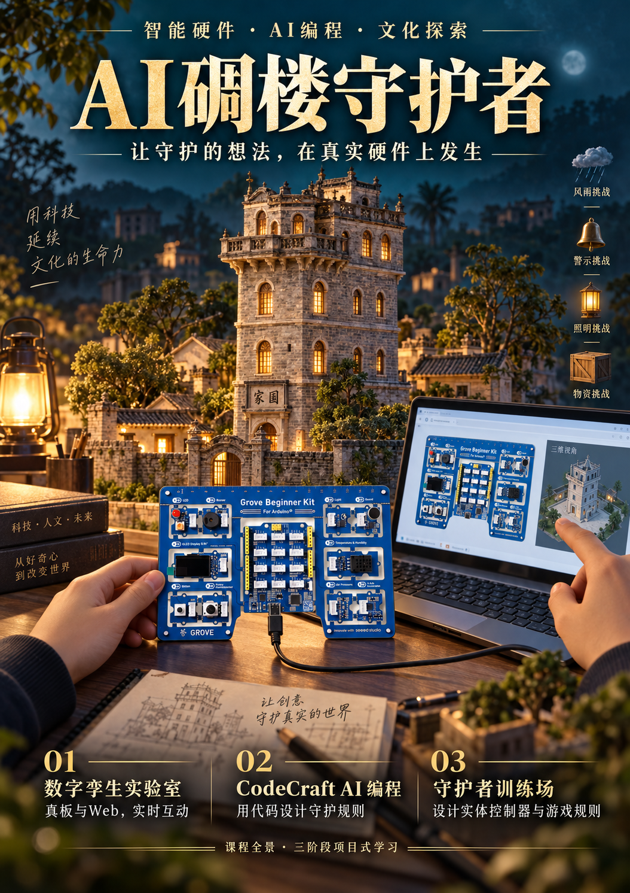
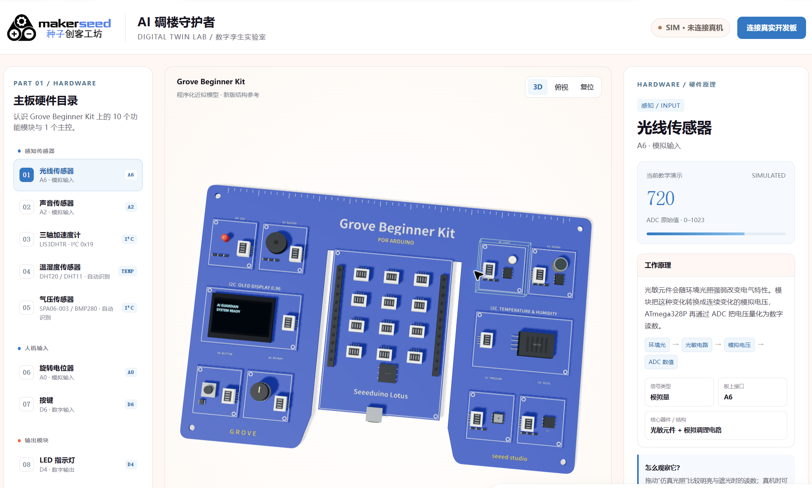

# [AI碉楼守护者](https://github.com/liwlin/seeed/tree/main/AI%E7%A2%89%E6%A5%BC%E5%AE%88%E6%8A%A4%E8%80%85 "AI碉楼守护者")

本仓库发布柴火课程的教学材料与配套Web工具，供教师和学员使用。

## 课程海报

  

[下载海报原图](AI碉楼守护者/课程海报/AI碉楼守护者_课程海报.png)。海报呈现三阶段课程全景；当前发布Part1，Part2与Part3仍在开发中。

## Part 1 特色工具：数字孪生网页

通过网页点选硬件模块，查看板上位置、工作原理和当前状态。连接真板后，学员操作真实输入，观察网页变化；也能从网页控制实体LED、蜂鸣器和OLED，并借助加速度数据理解倾斜姿态。

截图由课程作者提供，画面处于`SIM · 未连接真机`状态。海报中的电脑画面是情境设计；上图展示课程实际网页，两者不作为实板验收结果。

[下载截图原图](AI碉楼守护者/课程海报/Part1_数字孪生网页截图.png) · [稳定版工具与启动说明](web/makerseed_twin_v1_10_3_complete/README.md) · [网页源码](web/makerseed_twin_v1_10_3_complete/standalone.html)

## 三部分课程架构

### Part 1：数字孪生实验室（已经完成）

真实硬件 ⇄ Web实时交互，认识全部硬件。3D仿真板卡，输入只能操作真板，输出由网页反控实物，加速度通过3D小窗帮助理解姿态。

### Part 2：CodeCraft AI 编程主线（开发中...）

Mission Center只提供碉楼故事、任务和要求，不连接硬件。学员通过CodeCraft AI完成OLED、LED、蜂鸣器、光线、声音、按键、旋钮、温湿度、气压、加速度等编程学习。

### Part 3：守护者训练场（开发中...）

Web实时交互重新回来。课程方预制Controller Lab、Game Engine和4个游戏场景；学员负责设计实体硬件控制器和游戏规则。

## 当前发布：Part 1 数字孪生实验室

75分钟，碉楼故事20分钟、真实硬件与Web数字孪生探索55分钟。材料包含十模块探索任务、教师逐段讲义、学员任务册、18页图文课件和两页A4记录单。

- [Part 1课程入口](AI碉楼守护者/Part1_认识守护者/README.md)
- [教学PPTX](AI碉楼守护者/Part1_认识守护者/教学课件.pptx)
- [两页A4打印记录单](AI碉楼守护者/Part1_认识守护者/打印材料/课堂记录单_双面A4.pdf)
- [V1.10.3 Web工具说明](web/makerseed_twin_v1_10_3_complete/README.md)，含网页、配套固件、启动脚本、自动测试与姿态算法验证。

Web工具请下载或克隆到本地，按随包说明运行 `start_server.bat`，再用桌面 Chrome / Edge 打开本地页面。GitHub文件预览用于阅读源码，不是课程交互网页的运行入口。网页与固件须使用兼容版本；课程截图不能代替真实板课堂验收。

V1.10.3是当前稳定版工具。实际课堂需核对真实输入、实体输出和设备交接；三轴加速度计不能单独确定航向。

## 仓库内容

- [AI 碉楼守护者课程](AI碉楼守护者/README.md)：当前发布 Part1 课程；Part2、Part3 仅保留空目录占位。
- `web/makerseed_twin_v1_10_3_complete/`：当前 Part 1 数字孪生稳定基线，课程优先使用此版本。

`web/`仅保留当前稳定版`makerseed_twin_v1_10_3_complete`。旧版本目录与ZIP不纳入当前发布。

Part2、Part3尚未完善，GitHub当前版本只保留`.gitkeep`占位。草稿在本地保留并被忽略，不纳入课程发布。

